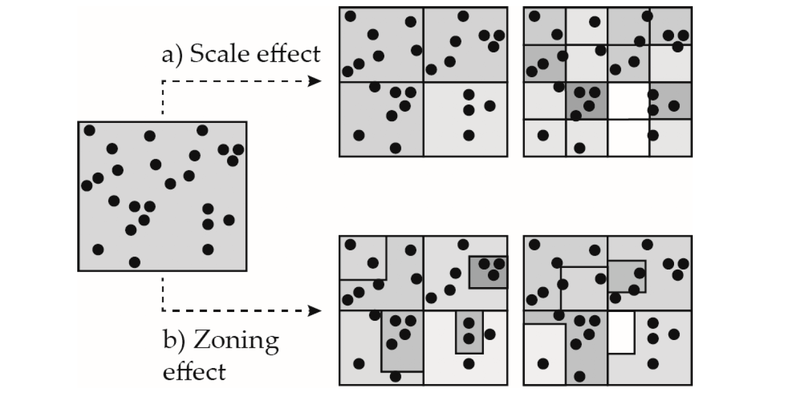

# Spatial Data {#spatial_data}

This Chapter seeks to present and describe distinctive attributes of spatial data, and discuss some of the main challenges in analysing and modelling these data. Spatial data is a term used to describe any data associating a given variable attribute to a specific location on the Earth's surface. 

## Spatial Data types

Different classifications of spatial data types exist. Knowing the structure of the data at hand is important as specific analytical methods would be more appropriate for particular data types. We will use a particular classification involving four data types: lattice/areal data, point data, flow data and trajectory data (Fig. 1). This is not a exhaustive list but it is helpful to motivate the analytical and modelling methods that we cover in this book.


*Lattice/Areal Data*. These data correspond to records of attribute values (such as population counts) for a fixed geographical area. They may comprise regular shapes (such as grids or pixels) or irregular shapes (such as states, counties or travel-to-work areas). Raster data are a common source of regular lattice/areal area, while censuses are probably the most common form of irregular lattice/areal area. Point data within an area can be aggregated to produce lattice/areal data.

*Point Data*. These data refer to records of the geographic location of an discrete event, or the number of occurrences of geographical process at a given location. As displayed in Fig. 1, examples include the geographic location of bus stops in a city, or the number of boarding passengers at each bus stop. 

*Flow Data*. These data refer to records of measurements for a pair of geographic point locations. or pair of areas. These data capture the linkage or spatial interaction between two locations. Migration flows between a place of origin and a place of destination is an example of this type of data.

*Trajectory Data*. These data record geographic locations of moving objects at various points in time. A trajectory is composed of a single string of data recording the geographic location of an object at various points in time and each record in the string contains a time stamp. These data are complex and can be classified into explicit trajectory data and implicit trajectory data. The former refer to well-structured data and record positions of objects continuously and intensively at uniform time intervals, such as GPS data. The latter is less structured and record data in relatively time point intervals, including sensor-based, network-based and signal-based data (@kong2018big).

In this course, we cover analytical and modelling approaches for point, lattice/areal and flow data. While we do not explicitly analyse trajectory data, various of the analytical approaches described in this book can be extended to incorporate time, and can be applied to model these types of data. In Chapter \@ref(sta), we describe approaches to analyse and model spatio-temporal data. These same methods can be applied to trajectory data.

## Hierarchical Structure of Data

The hierarchical organisation is a key feature of spatial data. Smaller geographical units are organised within larger geographical units. You can find the hierarchical representation of UK Statistical Geographies on the [Office for National Statistics website](https://geoportal.statistics.gov.uk/search?collection=Document&sort=name&tags=all(DOC_HRSG%2CDEC_2020)). In the bottom part of the output below, we can observe a spatial data frame for Liverpool displaying the hierarchical structure of census data (from the smallest to the largest): Output Areas (OAs), Lower Super Output Areas (LSOAs), Middle Super Output Areas (MSOAs) and Local Authority Districts (LADs). This hierarchical structure entails that units in smaller geographies are nested within units in larger geographies, and that smaller units can be aggregated to produce large units.

```{r, echo=FALSE, warning=FALSE, message=FALSE, results="hide"}
library(sf)
oa_shp <- st_read("data/census/Liverpool_OA.shp")
```
```{r, echo=FALSE}
head(oa_shp[,1:4])
```

Next we quickly go through the components of the output above. The first line indicates the type of feature and the number of rows (features) and columns (fields) in the data frame, except for the geometry. The second and third lines identify the type of geometry and dimension. The fourth line `bbox` stands for bounding box and display the min and max coordinates containing the Liverpool area in the data frame. The fifth line `projected CRS` indicates the coordinate reference system projection. If you would like to learn more about the various components of spatial data frames, please see the *R* `sf` package vignette on [Simple Features](https://r-spatial.github.io/sf/articles/sf1.html).

## Key Challenges

Major challenges exist when working with spatial data. Below we explore some of the key longstanding problems data scientists often face when working with geographical data. 

### Modifible Area Unit Problem (MAUP)

The Modifible Area Unit Problem (MAUP) represents a challenge that has troubled geographers for decades [@openshaw1981modifiable]. Two aspects of the MAUP are normally recognised in empirical analysis relating to *scale* and *zonation*. Fig. 2 illustrates these issues 

* *Scale* refers to the idea that a geographical area can be divided into geographies with differing numbers of spatial units.

* *Zonation* refers to the idea that a geographical area can be divided into the same number of units in a variety of ways.



The MAUP is a critical issue as it can impact our analysis and thus any conclusions we can infer from our results [e.g. @fotheringham1991modifiable]. There is no agreed systematic approach on how to handle the effects of the MAUP. Some have suggested to perform analyses based on different existing geographical scales, and assess the consistency of the results and identify potential sources of change. The issue with such approach is that results from analysis at different scales are likely to differ because distinct dimensions of a geographic process may be captured at different scales. For example, in migration studies, smaller geographies may be more suitable to capture residential mobility over short distances, while large geographies may be more suitable to capture long-distance migration. And it is well documented that these types of moves are driven by different factors. While residential mobility tends to be driven by housing related reasons, long-distance migration is more closely related to employment-related motives [@niedomysl2011migration].

An alternative approach is to use the smallest geographical system available and create random aggregations at various geographical scales, to directly quantify the extent of scale and zonation. This approach has shown promising results in applications to study internal migration flows [@stillwell2018spatial]. Another approach involves the production of "meaningful" or functional geographies that can more appropriately capture the process of interest. There is an active area of work defining functional labour markets [@casado2017evolutionary], urban areas [@arribas2019building] and various forms of geodemographic classifications [@singleton2014past; @patias2019scalable]. However there is the recognition that none of the existing approaches resolve the effects of the MAUP and recently it has been suggested that the most plausible ‘solution’ would be to ignore the MAUP [@wolf2020quantitative].

### Ecological Fallacy

Ecological fallacy is an error in the interpretation of statistical data based on aggregate information. Specifically it refers to inferences made about the nature of specific individuals based solely on statistics aggregated for a given group. It is about thinking that relationships observed for groups necessarily hold for individuals. A key example is @robinson1950ecological who illustrates this problem exploring the difference between ecological correlations and individual correlations. He looked at the relationship between country of birth and literacy. @robinson1950ecological used the percent of foreign-born population and percent of literate population for the 48 states in the United States in 1930. The ecological correlation based on these data was `0.53`. This suggests a positive association between foreign birth and literacy, and could be interpreted as foreign born individuals being more likely to be literate than native-born individuals. Yet, the correlation based on individual data was negative `-0.11` which indicates the opposite. The main point emerging from this example is to carefully interpret analysis based on spatial data and avoid making inferences about individuals from these data.

### Spatial Dependence

Spatial dependence refers to the spatial relationship of a variable’s values for a pair of locations at a certain distance apart, so that these values are more similar (or less similar) than expected for randomly associated pairs of observations [@anselin1988spatial]. For example, we could think of observed patterns of ethnic segregation in an area are a result of spillover effects of pre-existing patterns of ethnic segregation in neighbouring areas. Chapter \@ref(spatialecon) will illustrate approach to explicitly incorporate spatial dependence in regression analysis.

### Spatial Heterogeneity

Spatial heterogeneity refers to the uneven distribution of a variable’s values across space. Concentration of deprivation or unemployment across an area are good examples of spatial heterogeneity. We illustrate various ways to visualise, explore and measure the spatial distribution of data in multiple chapters. We also discuss on potential modelling approaches to capture spatial heterogeneity in Chapters \@ref(spatialecon), \@ref(mlm1) and \@ref(sta).

### Spatial nonstationarity

Spatial nonstationarity refers to variations in the relationship between an outcome variable and a set of predictor variables across space. In a modelling context, it relates to a situation in which a simple "global" model is inappropriate to explain the relationships between a set of variables. The geographical nature of the model must be modified to reflect local structural relationships within the data. For example, ethinic segregation has been positively associated with employment outcomes in some countries pointing to networks in pre-existing communities facilitating access to the local labour market. Inversely ethinic segregation has been negatively associated with employment outcomes pointing to lack of integration into the broader local community. We illustrate various modelling approaches to capture spatial nonstationarity in Chapters \@ref(mlm2) and \@ref(gwr).


