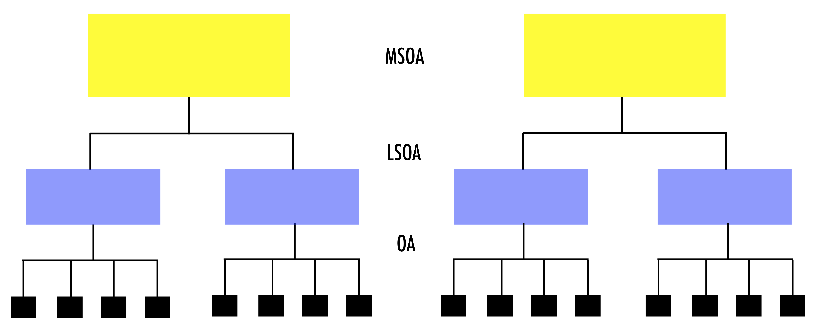
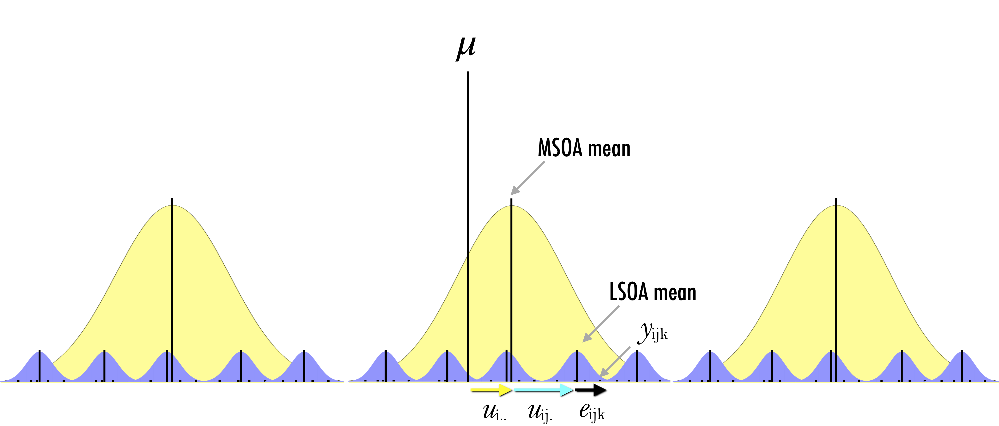

# Multilevel Modelling - Part 1

This chapter^[This note is part of [Spatial Analysis Notes](index.html) <a rel="license" href="http://creativecommons.org/licenses/by-nc-sa/4.0/"></a><br /><span xmlns:dct="http://purl.org/dc/terms/" property="dct:title">Multilevel Modelling -- Random Intercept Multilevel Model</span> by <a xmlns:cc="http://creativecommons.org/ns#" href="http://franciscorowe.com" property="cc:attributionName" rel="cc:attributionURL">Francisco Rowe</a> is licensed under a <a rel="license" href="http://creativecommons.org/licenses/by-nc-sa/4.0/">Creative Commons Attribution-NonCommercial-ShareAlike 4.0 International License</a>.] provides an introduction to multi-level data structures and multi-level modelling.


The content of this chapter is based on:

* @Gelman_Hill_2006_book provides an excellent and intuitive explanation of multilevel modelling and data analysis in general. Read Part 2A for a really good explanation of multilevel models.

* @bristol2020 is an useful online resource on multilevel modelling and is free!

This Chapter is part of [Spatial Analysis Notes](index.html), a compilation hosted as a GitHub repository that you can access it in a few ways:

* As a [download](https://github.com/GDSL-UL/san/archive/master.zip) of a `.zip` file that contains all the materials.
* As an [html
  website](https://gdsl-ul.github.io/san/multilevel-modelling-part-1.html).
* As a [pdf
  document](https://gdsl-ul.github.io/san/spatial_analysis_notes.pdf)
* As a [GitHub repository](https://github.com/GDSL-UL/san).

## Dependencies

This chapter uses the following libraries: Ensure they are installed on your machine^[You can install package `mypackage` by running the command `install.packages("mypackage")` on the R prompt or through the `Tools --> Install Packages...` menu in RStudio.] before loading them executing the following code chunk:

```{r, message = FALSE}
# Data manipulation, transformation and visualisation
library(tidyverse)
# Nice tables
library(kableExtra)
# Simple features (a standardised way to encode vector data ie. points, lines, polygons)
library(sf) 
# Spatial objects conversion
library(sp) 
# Thematic maps
library(tmap) 
# Colour palettes
library(RColorBrewer) 
# More colour palettes
library(viridis) # nice colour schemes
# Fitting multilevel models
library(lme4)
# Tools for extracting information generated by lme4
library(merTools)
# Exportable regression tables
library(jtools)
library(stargazer)
library(sjPlot)
```

## Data

For this chapter, we will data for Liverpool from England's 2011 Census. The original source is the [Office of National Statistics](https://www.nomisweb.co.uk/home/census2001.asp) and the dataset comprises a number of selected variables capturing demographic, health and socio-economic attributes of the local resident population at four geographic levels: Output Area (OA), Lower Super Output Area (LSOA), Middle Super Output Area (MSOA) and Local Authority District (LAD). The variables include population counts and percentages. For a description of the variables, see the readme file in the mlm data folder.^[Read the file in R by executing `read_tsv("data/mlm/readme.txt")`]

Let us read the data:

```{r}
# clean workspace
rm(list=ls())
# read data
oa_shp <- st_read("data/mlm/oa.shp")
```


We can now attach and visualise the structure of the data. 

```{r}
# attach data frame
attach(oa_shp)

# sort data by oa
oa_shp <- oa_shp[order(oa_cd),]
head(oa_shp)
```



The data are hierarchically structured: OAs nested within LSOAs; LSOAs nested within MSOAs; and, MSOAs nested within LADs. Observations nested within higher geographical units may be correlated. 

This is one type of hierarchical structure. There is a range of data structures: 
* Strict nested data structures eg. an individual unit is nested within only one higher unit
* Repeated measures structures eg. various measurements for an individual unit
* Crossed classified structures eg. individuals may work and live in different neighbourhoods
* Multiple membership structure eg. individuals may have two different work places

*Why should we care about the structure of the data?*
* *Draw correct statistical inference*: Failing to recognise hierarchical structures will lead to underestimated standard errors of regression coefficients and an overstatement of statistical significance. Standard errors for the coefficients of higher-level predictor variables will be the most affected by ignoring grouping.
* *Link context to individual units*: We can link and understand the extent of group effects on individual outcomes eg. how belonging to a certain socio-economic group influences on future career opportunities.
* *Spatial dependency*: Recognising the hierarchical structure of data may help mitigate the effects of severe spatial autocorrelation.

Quickly, let us get a better idea about the data and look at the number of OAs nested within LSOAs and MSOAs

```{r}
# mean of nested OAs within LSOAs and MSOAs
lsoa_cd %>% table() %>%
  mean() %>%
  round(, 2)

msoa_cd %>% table() %>%
  mean() %>%
  round(, 2)

# number of OAs nested within LSOAs and MSOAs
lsoa_cd %>% table() %>%
  sort() %>%
  plot()

msoa_cd %>% table() %>%
  sort() %>%
  plot()
```

## Modelling 

We should now be persuaded that ignoring the hierarchical structure of data may be a major issue. Let us now use a simple example to understand the intuition of multilevel model using the census data. We will seek to understand the spatial distribution of the proportion of population in unemployment in Liverpool, particularly why and where concentrations in this proportion occur. To illustrate the advantages of taking a multilevel modelling approach, we will start by estimating a linear regression model and progressively building complexity. We will first estimate a model and then explain the intuition underpinning the process. We will seek to gain a general understanding of multilevel modelling. If you are interested in the statistical and mathemathical formalisation of the underpinning concepts, please refer to @Gelman_Hill_2006_book.

We first need to want to understand our dependent variable: its density ditribution;

```{r}
ggplot(data = oa_shp) +
geom_density(alpha=0.8, colour="black", fill="lightblue", aes(x = unemp)) +
   theme_classic()
```

```{r}
summary(unemp)
```

and, its spatial distribution:

```{r}
# ensure geometry is valid
oa_shp = lwgeom::st_make_valid(oa_shp)

# create a map
legend_title = expression("% unemployment")
map_oa = tm_shape(oa_shp) +
  tm_fill(col = "unemp", title = legend_title, palette = magma(256, begin = 0.25, end = 1), style = "cont") + 
  tm_borders(col = "white", lwd = .01)  + 
  tm_compass(type = "arrow", position = c("right", "top") , size = 4) + 
  tm_scale_bar(breaks = c(0,1,2), text.size = 0.5, position =  c("center", "bottom")) 
map_oa
```

Let us look at those areas:

```{r}
# high %s
oa_shp %>% filter(unemp > 0.2) %>% 
  dplyr::select(oa_cd, pop, unemp) 
```

### Baseline Linear Regression Model

Now let us estimate a simple linear regression model with the intercept only:

```{r}
# specify a model equation
eq1 <- unemp ~ 1
model1 <- lm(formula = eq1, data = oa_shp)

# estimates
summary(model1)
```

To understand the differences between the linear regression model and multilevel models, let us consider the model we have estimated:

$$y_{i} = \beta_{0} + e_{i}$$
where $y_{i}$ represents the proportion of the unemployed resident population in the OA $i$; $\beta_{0}$ is the regression intercept and measures the average proportion of the unemployed resident population across OAs; and, $e_{i}$ is the error term. But how do we deal with the hierarchical structure of the data? 

#### Limitations

Before looking at the answer, let's first understand some of the key limitations of the linear regression model to handle the hierarchical structure of data. A key limitation of the linear regression model is that it only captures average relationships in the data. It does not capture variations in the relationship between variables across areas or groups. Another key limitation is that the linear regression model can capture associations at either macro or micro levels, but it does not simultaneously measure their interdependencies.

To illustrate this, let us consider the regression intercept. It indicates that the average percentage of unemployed population at the OA level is 0.12 but this model ignores any spatial clustering ie. the percentage of unemployed population tends to be similar across OAs nested within a same LSOA or MSOA. A side effect of ignoring this is that our standard errors are biased, and thus claims about statistical significance based on them would be misleading. Additionally, this situation also means we cannot explore variations in the percentage of unemployed population across LSOAs or MSOAs ie. how the percentage of unemployed population may be dependent on various contextual factors at these geographical scales.

#### Fixed Effect Approach

An alternative approach is to adopt a fixed effects approach, or no-pooling model; that is, adding dummy variables indicating the group classification into the regression model eg. the way OAs is nested within LSOAs (or MSOAs). This approach has limitations. First, there is high risk of overfitting. The number of groups may be too large, relative to the number of observations. Second, the estimation of multiple parameters may be required so that measuring differences between groups may be challenging. Third, a fixed effects approach does not allow including group-level explanatory variables. You can try fitting a linear regression model extending our estimated model to include dummy variables for individual LSOAs (and/or MSOAs) so you can compare this to the multilevel model below. 

An alternative is fitting separate linear regression models for each group. This approach is not always possible if there are groups with small sizes.

## Multilevel Modelling: Random Intercept Model

We use multilevel modelling to account for the hierarchical nature of the data by explicitly recognising that OAs are nested within LSOAs and MSOAs. Multilevel models can easily be estimated using in R using the package `lme4`. We implement an two-level model to allow for variation across LSOAs. We estimate an only intercept model allowing for variation across LSOAs. In essence, we are estimating a model with varying intercept coefficient by LSOA. As you can see in the code chunk below, the equation has an additional component. This is the group component or LSOA effect. The `(1 | lsoa_cd)` means that we are allowing the intercept, represented by 1, to vary by LSOA.

```{r}
# specify a model equation
eq2 <- unemp ~ 1 + (1 | lsoa_cd)
model2 <- lmer(eq2, data = oa_shp)

# estimates
summary(model2)
```

We can estimate a three-level model by adding `(1 | msoa_cd)` to allow the intercept to also vary by MSOAs and account for the nesting structure of LSOAs within MSOAs.

```{r}
# specify a model equation
eq3 <- unemp ~ 1 + (1 | lsoa_cd) + (1 | msoa_cd)
model3 <- lmer(eq3, data = oa_shp)

# estimates
summary(model3)
```

We see two sets of coefficients: *fixed effects* and *random effects*. *Fixed effects* correspond to the standard linear regression coefficients. Their interpretation is as usual. *Random effects* are the novelty. It is a term in multilevel modelling and refers to varying coefficients i.e. the randomness in the probability of the model for the group-level coefficients. Specifically they relate to estimates of the average variance and standard deviation within groups (i.e. LSOAs or MSOAs). Intiutively, variance and standard deviation indicate the extent to which the intercept, on average, varies by LSOAs and MSOAs.





More formally, we first estimated the simplest regression model which is an intercept-only model and equivalent to the sample mean (i.e. the *fixed* part of the model):

$$y_{ijk} = \mu + e_{ijk}$$
and then we made the *random* part of the model ($e_{ijk}$) more complex to account for the hierarchical structure of the data by estimating the following three-level regression model:

$$y_{ijk} = \mu + u_{i..} + u_{ij.} + e_{ijk}$$

where $y_{ijk}$ represents the proportion of unemployed population in OA $i$ nested within LSOA $j$ and MSOA $k$; $\mu$ represents the sample mean and the *fixed* part of the model; $e_{ijk}$ is the deviation of an observation from its LSOA mean; $u_{ij.}$ is the deviation of the LSOA mean from its MSOA mean; $u_{i..}$ is the deviation of the MSOA mean from the fixed part of the model $\mu$. Conceptually, this model is decomposing the variance of the model in terms of the hierarchical structure of the data. It is partitioning the observation’s residual into three parts or *variance components*. These components measure the relative extent of variation of each hierarchical level ie. LSOA, MSOA and grand means. To estimate the set of residuals, they are assumed to follow a normal distribution and are obtained after fitting the model and are based on the estimates of the model parameters (i.e. intercept and variances of the random parameters).

Let's now return to our three-level model (reported again below), we see that the intercept or fixed part of the model is the same as for the linear regression. The multilevel model reports greater standard errors. Multilevel models capture the hierarchical structure of the data and thus more precisely estimate the standard errors for our parameters.

```{r}
# report model 3
summary(model3)
```

### Interpretation

> Fixed effects

We start by examining the fixed effects or estimated model averaging over LSOAs and MSOAs, $y_{ijk} = 0.115288$ which can also be called by executing:

```{r}
fixef(model3)
```

Th estimated intercept indicates that the overall mean taken across LSOAs and MSOAs is estimated as `0.115288` and is statistically significant at `5%` significance.

> Random effects

The set of random effects contains three estimates of variance and standard deviation and refer to the variance components discussed above. The `lsoa_cd`, `msoa_cd` and `Residual` estimates indicate that the extent of estimated LSOA-, MSOA- and individual-level variance is `0.0007603`, `0.0020735` and `0.0025723`, respectively.

### Variance Partition Coefficient (VPC)

The purpose of multilevel models is to partition variance in the outcome between the different groupings in the data. We thus often want to know the percentage of variation in the dependent variable accounted by differences across groups i.e. what proportion of the total variance is attributable to variation within-groups, or how much is found between-groups. The statistic to obtain this is termed the variance partition coefficient (VPC), or intraclass correlation.^[The VPC is equal to the intra-class correlation coefficient which is the correlation between the observations of the dependent variable selected randomly from the same group. For instance, if the VPC is 0.1, we would say that 10% of the variation is between groups and 90% within. The correlation between randomly chosen pairs of observations belonging to the same group is 0.1.] For our case, the VPC at the LSOA level indicates that 14% of the variation in percentage of unemployed resident population across OAs can be explained by differences across LSOAs. What is the VPC at the MSOA level?


```{r}
vpc_lsoa <- 0.0007603 / (0.0007603 + 0.0020735 + 0.0025723)
vpc_lsoa * 100
```

You can also obtain the VPC by executing:
```{r}
#summ(model3)
```

### Uncertainty of Estimates

You may have noticed that `lme4` does not provide p-values, because of [various reasons](https://stat.ethz.ch/pipermail/r-help/2006-May/094765.html) as explained by Doug Bates, one of the author of `lme4`. These explanations mainly refer to the complexity of dealing with varying sample sizes at a given hierarchical level. The number of observations at each hierarchical level varies across individual groupings (i.e. LSOA or MSOA). It may even be one single observation. This has implications for the distributional assumptions, denominator degrees of freedom and how to approximate a "best" solution. Various approaches exist to compute the statistical significance of estimates. We use the `confint` function available within `lme4` to obtain confidence intervals.

```{r}
confint(model3, level = 0.95)
```

`.sig01` refers to the LSOA level; `.sig02` refers to the MSOA level; and, `.sigma` refers to the OA level.

### Assessing Group-level Variation

*Estimated regression coefficients*

In multilevel modelling, our primary interest is in knowing differences across groups. To visualise the estimated model within each group (ie. LSOA and MSOA), we type:

```{r}
coef_m3 <- coef(model3)
head(coef_m3$lsoa_cd,5)
```
The results indicate that the estimated regression line is $y = 0.09915456$ for LSOA `E01006512`; $y = 0.09889615$ for LSOA `E01006513` and so forth. Try getting the estimated model within each MSOA.

*Random effects*

We can look at the estimated group-level (or LSOA-level and MSOA-level) errors; that is, *random effects*:

```{r}
ranef_m3 <- ranef(model3)
head(ranef_m3$lsoa_cd, 5)
```

Group-level errors indicate how much the intercept is shifted up or down in particular groups (ie. LSOAs or MSOAs). Thus, for example, in LSOA `E01006512`, the estimated intercept is `-0.01613353` lower than average, so that the regression line is `(0.1152881 - 0.01613353)` `= 0.09915457` which is what we observed from the call to `coef()`.

We can also obtain group-level errors (*random effects*) by using a simulation approach, labelled "Empirical Bayes" and discussed [here](https://stat.ethz.ch/pipermail/r-sig-mixed-models/2009q4/002984.html). To this end, we run:

```{r}
# obtain estimates
REsim(model3) %>% head(10)
```

The results contain the estimated mean, median and standard deviation for the intercept within each group (e.g. LSOA). The mean estimates are similar to those obtained from `ranef` with some small differences due to rounding.

To gain an undertanding of the general pattern of the *random effects*, we can use caterpillar plots via `plotREsim` - reported below. The plot on the right shows the estimated random effects for each MSOA and their respective interval estimate. Note that random effects are on average zero, represented by the red horizontal line. Intervals that do not include zero are in bold. Also note that the width of the confidence interval depends on the standard error of the respective residual estimate, which is inversely related to the size of the sample. The residuals represent an observation departures from the grand mean, so an observation whose confidence interval does not overlap the line at zero (representing the mean proportion of unemployed population across all areas) is said to differ significantly from the average at the 5% level. 

```{r}
# plot
plotREsim(REsim(model3)) 
```

Focusing on the plot on the right, we see MSOAs whose mean proportion of unemployed population, assuming no explanatory variables, is lower than average. On the right-hand side of the plot, you will see MSOAs whose mean proportion is higher than average. The MSOAs with the smallest residuals include the districts of Allerton and Hunt Cross, Church, Childwall, Wavertree and Woolton. What districts do we have at the other extreme?

```{r}
re <- REsim(model3)
oa_shp %>% dplyr::select(msoa_cd, ward_nm, unemp) %>%
    filter(as.character(msoa_cd) == "E02001387" | as.character(msoa_cd) == "E02001393")
```
 
 We can also map the MSOA-level *random effects*. To this end, we first need to read a shapefile containing data at the MSOA level and merge it with the *random effects* estimates.
 
```{r}
# read data
msoa_shp <- st_read("data/mlm/MSOA.shp")

# create a dataframe for MSOA-level random effects
re_msoa <- re %>% filter(groupFctr == "msoa_cd")
str(re_msoa)

# merge data
msoa_shp <- merge(x = msoa_shp, y = re_msoa, by.x = "MSOA_CD", by.y = "groupID")
```

Now we can create our map:

```{r}
# create a map
legend_title = expression("MSOA-level residuals")
map_msoa = tm_shape(msoa_shp) +
  tm_fill(col = "mean", title = legend_title, palette = magma(256, begin = 0, end = 1), style = "cont") + 
  tm_borders(col = "white", lwd = .01)  + 
  tm_compass(type = "arrow", position = c("right", "top") , size = 4) + 
  tm_scale_bar(breaks = c(0,1,2), text.size = 0.5, position =  c("center", "bottom")) 
map_msoa
```
 
### Adding Individual-level Predictors

In this example, $\mu$ represents the sample mean but it could include a collection of independent variables or predictors. To explain the logic, we will assume that unemployment is strongly associated to long-term illness. We could expect that long-term illness (`lt_ill`) will reduce the chances of working and therefore being unemployed. Note that our focus is on the relationship, not on establishing causation. Specifically we want to estimate the relationship between unemployment and long-term illness and we are interested in variations in OA-level unemployment by MSOAs so we will estimate the following two-level model:

OA-level:

$$y_{ij} = \beta_{0j} + \beta_{1}x_{ij} + e_{ij}$$
MSOA-level:

$$\beta_{0j} = \beta_{0} + u_{0j}$$
Replacing the first equation into the second, we have:

$$y_{ij} = (\beta_{0} + u_{0j}) + \beta_{1}x_{ij} + e_{ij}$$
where $y$ the proportion of unemployed population in OA $i$ within MSOA $j$; $\beta_{0}$ is the fixed intercept (averaging over all MSOAs); $u_{0j}$ represents the MSOA-level redisuals or *random effects*; $\beta_{0}$ and $u_{0j}$ together represent the varying-intercept; $\beta_{1}$ is the slope coefficient; $x_{ij}$ represents the percentage of long-term illness population; and, $e_{ij}$ is the individual-level residuals.

We estimate the model executing:
```{r}
# change to proportion
oa_shp$lt_ill <- lt_ill/100

# specify a model equation
eq4 <- unemp ~ lt_ill + (1 | msoa_cd)
model4 <- lmer(eq4, data = oa_shp)

# estimates
summary(model4)
```

*Fixed effects*: model averaging over MSOAs

```{r}
fixef(model4)
```

yields an estimated regression line in an average LSOA: $y =  0.04681959 + 0.29588110x$

*Random effects*: MSOA-level errors

```{r}
ranef_m4 <- ranef(model4)
head(ranef_m4$msoa_cd, 5)
```

yields an estimated intercept for MSOA `E02001347` which is `0.017474815` lower than the average with a regression line: `(0.04681959 - 0.017474815) + 0.29588110x` `=` `0.02934478 + 0.29588110x`. You can confirm this by looking at the estimated model within each MSOA by executing (remove the `#` sign):

```{r}
#coef(model4)
```

*Fixed effect correlations*

In the bottom of the output, we have the correlations between the fixed-effects estimates. In our example, it refers to the correlation between $\beta_{0}$ and $\beta_{1}$. It is negative indicating that in MSOAs where the relationship between unemployment and long-term illness is greater, as measured by $\beta_{1}$, the average proportion of unemployed people tends to be smaller, as captured by $\beta_{0}$.

### Adding Group-level Predictors

We can also add group-level predictors. We use the formulation:

OA-level:

$$y_{ij} = \beta_{0j} + \beta_{1}x_{ij} + e_{ij}$$

MSOA-level:

$$\beta_{0j} = \beta_{0} + \gamma_{1}m_{j} + u_{0j}$$

where $x_{ij}$ is the OA-level proportion of population suffering long-term illness and $m_{j}$ is the MSOA-level proportion of male population. We first need to create this group-level predictor:

```{r}
# detach OA shp and attach MSOA shp
detach(oa_shp)
attach(msoa_shp)

# group-level predictor
msoa_shp$pr_male <- males/pop

# remove geometries
msoa_df <- `st_geometry<-`(msoa_shp, NULL)

# select variables
msoa_df <- msoa_df %>% dplyr::select(MSOA_CD, pop, pr_male)

# merge data sets
oa_shp <- merge(x=oa_shp, y=msoa_df, by.x = "msoa_cd", by.y="MSOA_CD")

# inspect data
head(oa_shp[1:10, c("msoa_cd", "oa_cd", "unemp", "pr_male")])
```

We can now estimate our model:
```{r}
detach(msoa_shp)
attach(oa_shp)

# specify a model equation
eq5 <- unemp ~ lt_ill + pr_male + (1 | msoa_cd)
model5 <- lmer(eq5, data = oa_shp)

# estimates
summary(model5)
```

This model includes the proportion of males and intercepts that vary by MSOA. The `lmer()`
function only accepts predictors at the individual level, so we have included data on the proportion of male population at this level. Explore and interpret the model running the functions below:

```{r}
# fixed effects
fixef(model5)
```

```{r}
# random effects
ranef_m5 <- ranef(model5)
head(ranef_m5$msoa_cd, 5)
```

Adding group-level predictors tends to improve inferences for group coefficients. Examine the confidence intervals, in order to evalute how the precision of our estimates of the MSOA intercepts have changed. *Have confidence intervals for the intercepts of Model 4 and 5 increased or reduced?* Hint: look at how to get the confidence intervals above.

## Model building

Now we know how to estimate multilevel regression models in *R*. The question that remains is: *When does multilevel modeling make a difference?* The short answer is: when there is little group-level variation. When there is very little group-level variation, the multilevel modelling reduces to classical linear regression estimates *with no group indicators*. Inversely, when group-level coefficients vary greatly (compared to their standard errors of estimation), multilevel modelling reduces to classical regression *with group indicators* @Gelman_Hill_2006_book.

*How do you go about building a model?* We generally start simple by fitting simple linear regressions and then work our way up to a full multilevel model - see @Gelman_Hill_2006_book p. 270.

*How many groups are needed?* As an absolute minimum, more than two groups are required. With only one or two groups, a multilevel model reduces to a linear regression model.

*How many observations per group?* Two observations per group is sufficient to fit a multilevel model. 

### Model Comparison

*How we assess different candidate models?* We can use the function `anova()` and assess various statistics: The Akaike Information Criterion (AIC), the Bayesian Information Criterion (BIC), Loglik and Deviance. Generally, we look for lower scores for all these indicators. We can also refer to the *Chisq* statistic below. It tests the hypothesis of whether additional predictors improve model fit. Particularly it tests the *Null Hypothesis* whether the coefficients of the additional predictors equal `0`. It does so comparing the deviance statistic and determining if changes in the deviance are statistically significant. Note that a major limitation of the deviance test is that it is for nested models i.e. a model being compared must be nested in the other.

Here compare three of our estimated models. It seems that adding varying intercepts for LSOA and MSOA levels provide the model with the better fit. Though, they don't explain the source of differences between OAs.

```{r}
anova(model3, model4, model5)
```

## Useful Functions

Function | Description
----------|---------------------------------------------
lmer() | fit linear mixed-effects models
fixef() | obtain estimated fixed effects or model averaging over groups
ranef() | obtain estimated random effects or group-level residuals
REsim() | obtain estimated random effects or group-level residuals based on simulation
plotREsim() | create a caterpillar plot of estimated random effects
coef() | obtain coefficients within each group
anova() | provide regression model diagnostics
