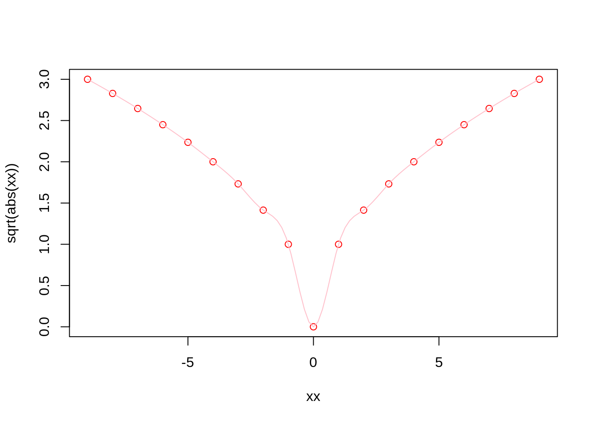
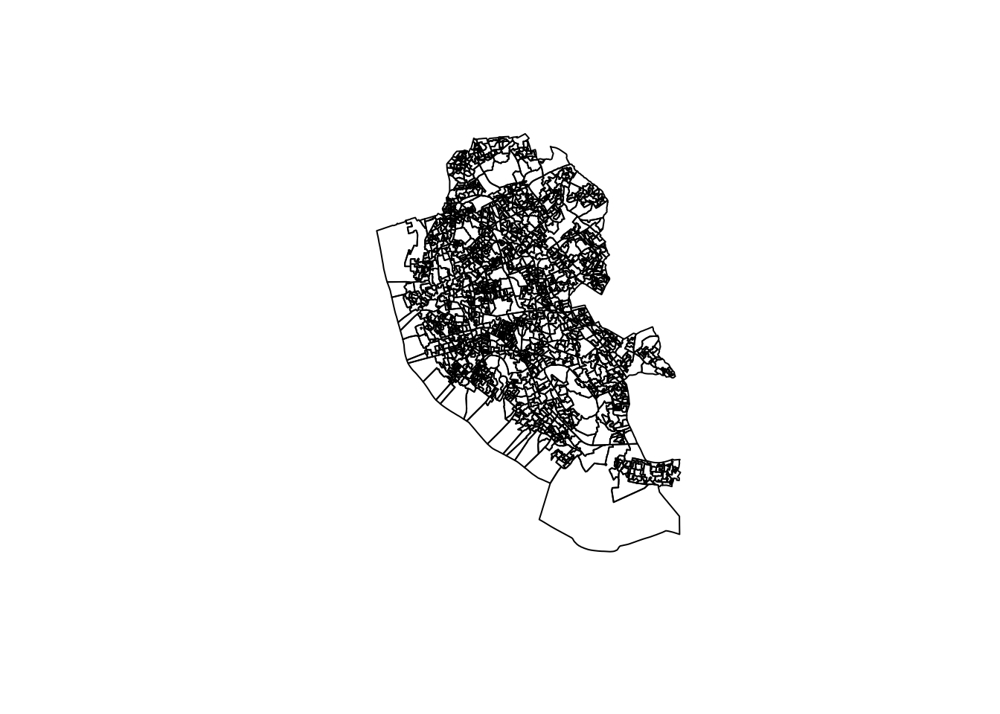
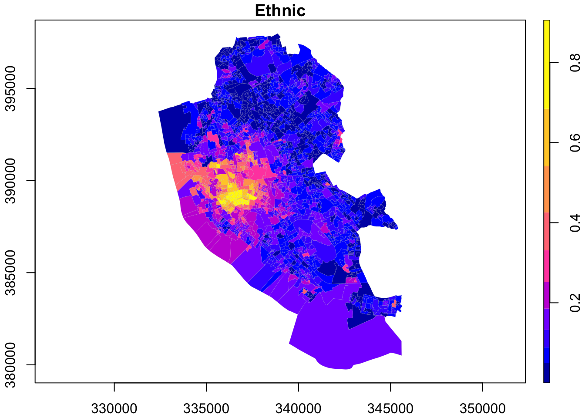
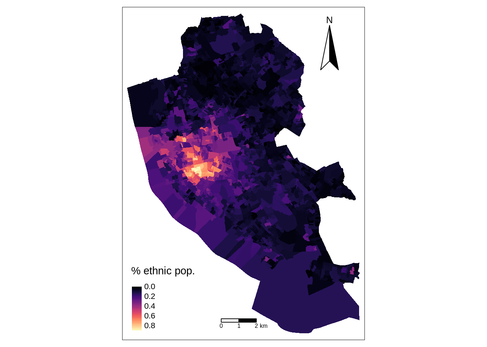
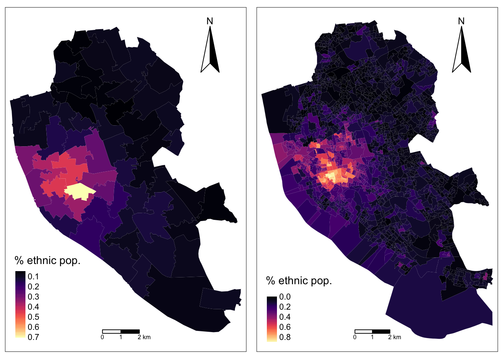

# Introduction {#intro}

This session^[This note is part of [Spatial Analysis Notes](index.html) <a rel="license" href="http://creativecommons.org/licenses/by-nc-sa/4.0/"></a><br /><span xmlns:dct="http://purl.org/dc/terms/" property="dct:title">Introduction -- R Notebooks + Basic Functions + Data Types</span> by <a xmlns:cc="http://creativecommons.org/ns#" href="http://franciscorowe.com" property="cc:attributionName" rel="cc:attributionURL">Francisco Rowe</a> is licensed under a <a rel="license" href="http://creativecommons.org/licenses/by-nc-sa/4.0/">Creative Commons Attribution-NonCommercial-ShareAlike 4.0 International License</a>.] introduces R Notebooks, basic functions and data types. These are all important concepts that we will use during the module.

If you are already familiar with R, R notebooks and data types, you may want to jump to Section [Read Data] and start from there. This section describes how to read and manipulate data using `sf` and `tidyverse` functions, including `mutate()`, `%>%` (known as pipe operator), `select()`, `filter()` and specific packages and functions how to manipulate spatial data.

The content of this session is based on the following references:

* @grolemund_wickham_2019_book, this book illustrates key libraries, including tidyverse, and functions for data manipulation in R

* @Xie_et_al_2019_book, excellent introduction to R markdown!

* @envs450_2018, some examples from the first lecture of ENVS450 are used to explain the various types of random variables.

* @Lovelace_et_al_2020_book, a really good book on handling spatial data and historical background of the evolution of R packages for spatial data analysis.

## Dependencies

This tutorial uses the libraries below. Ensure they are installed on your machine^[You can install package `mypackage` by running the command `install.packages("mypackage")` on the R prompt or through the `Tools --> Install Packages...` menu in RStudio.] before loading them executing the following code chunk:


```r
# Data manipulation, transformation and visualisation
library(tidyverse)
# Nice tables
library(kableExtra)
# Simple features (a standardised way to encode vector data ie. points, lines, polygons)
library(sf) 
# Spatial objects conversion
library(sp) 
# Thematic maps
library(tmap) 
# Colour palettes
library(RColorBrewer) 
# More colour palettes
library(viridis) # nice colour schemes
```


## Introducing R

R is a freely available language and environment for statistical computing and graphics which provides a wide variety of statistical and graphical techniques. It has gained widespread use in academia and industry. R offers a wider array of functionality than a traditional statistics package, such as SPSS and is composed of core (base) functionality, and is expandable through libraries hosted on [CRAN](https://cran.r-project.org). CRAN is a network of ftp and web servers around the world that store identical, up-to-date, versions of code and documentation for R.

Commands are sent to R using either the terminal / command line or the R Console which is installed with R on either Windows or OS X. On Linux, there is no equivalent of the console, however, third party solutions exist. On your own machine, R can be installed from [here](https://www.r-project.org/).

Normally RStudio is used to implement R coding. RStudio is an integrated development environment (IDE) for R and provides a more user-friendly front-end to R than the front-end provided with R.

To run R or RStudio, just double click on the R or RStudio icon. Throughout this module, we will be using RStudio:


If you would like to know more about the various features of RStudio, watch this [video](https://rstudio.com/products/rstudio/) 

## Setting the working directory

Before we start any analysis, ensure to set the path to the directory where we are working. We can easily do that with `setwd()`. Please replace in the following line the path to the folder where you have placed this file -and where the `data` folder lives.


```r
#setwd('../data/sar.csv')
#setwd('.')
```

Note: It is good practice to not include spaces when naming folders and files. Use *underscores* or *dots*.

You can check your current working directory by typing:

```r
getwd()
```

```
## [1] "/Users/Franciscorowe/Dropbox/Francisco/uol/teaching/envs453/201920/lectures/san"
```

## R Scripts and Notebooks

An *R script* is a series of commands that you can execute at one time and help you save time. So you don't repeat the same steps every time you want to execute the same process with different datasets. An R script is just a plain text file with R commands in it. 

To create an R script in RStudio, you need to

* Open a new script file: *File* > *New File* > *R Script*

* Write some code on your new script window by typing eg. `mtcars`

* Run the script. Click anywhere on the line of code, then hit *Ctrl + Enter* (Windows) or *Cmd + Enter* (Mac) to run the command or select the code chunk and click *run* on the right-top corner of your script window. If do that, you should get:

```r
mtcars
```

```
##                      mpg cyl  disp  hp drat    wt  qsec vs am gear carb
## Mazda RX4           21.0   6 160.0 110 3.90 2.620 16.46  0  1    4    4
## Mazda RX4 Wag       21.0   6 160.0 110 3.90 2.875 17.02  0  1    4    4
## Datsun 710          22.8   4 108.0  93 3.85 2.320 18.61  1  1    4    1
## Hornet 4 Drive      21.4   6 258.0 110 3.08 3.215 19.44  1  0    3    1
## Hornet Sportabout   18.7   8 360.0 175 3.15 3.440 17.02  0  0    3    2
## Valiant             18.1   6 225.0 105 2.76 3.460 20.22  1  0    3    1
## Duster 360          14.3   8 360.0 245 3.21 3.570 15.84  0  0    3    4
## Merc 240D           24.4   4 146.7  62 3.69 3.190 20.00  1  0    4    2
## Merc 230            22.8   4 140.8  95 3.92 3.150 22.90  1  0    4    2
## Merc 280            19.2   6 167.6 123 3.92 3.440 18.30  1  0    4    4
## Merc 280C           17.8   6 167.6 123 3.92 3.440 18.90  1  0    4    4
## Merc 450SE          16.4   8 275.8 180 3.07 4.070 17.40  0  0    3    3
## Merc 450SL          17.3   8 275.8 180 3.07 3.730 17.60  0  0    3    3
## Merc 450SLC         15.2   8 275.8 180 3.07 3.780 18.00  0  0    3    3
## Cadillac Fleetwood  10.4   8 472.0 205 2.93 5.250 17.98  0  0    3    4
## Lincoln Continental 10.4   8 460.0 215 3.00 5.424 17.82  0  0    3    4
## Chrysler Imperial   14.7   8 440.0 230 3.23 5.345 17.42  0  0    3    4
## Fiat 128            32.4   4  78.7  66 4.08 2.200 19.47  1  1    4    1
## Honda Civic         30.4   4  75.7  52 4.93 1.615 18.52  1  1    4    2
## Toyota Corolla      33.9   4  71.1  65 4.22 1.835 19.90  1  1    4    1
## Toyota Corona       21.5   4 120.1  97 3.70 2.465 20.01  1  0    3    1
## Dodge Challenger    15.5   8 318.0 150 2.76 3.520 16.87  0  0    3    2
## AMC Javelin         15.2   8 304.0 150 3.15 3.435 17.30  0  0    3    2
## Camaro Z28          13.3   8 350.0 245 3.73 3.840 15.41  0  0    3    4
## Pontiac Firebird    19.2   8 400.0 175 3.08 3.845 17.05  0  0    3    2
## Fiat X1-9           27.3   4  79.0  66 4.08 1.935 18.90  1  1    4    1
## Porsche 914-2       26.0   4 120.3  91 4.43 2.140 16.70  0  1    5    2
## Lotus Europa        30.4   4  95.1 113 3.77 1.513 16.90  1  1    5    2
## Ford Pantera L      15.8   8 351.0 264 4.22 3.170 14.50  0  1    5    4
## Ferrari Dino        19.7   6 145.0 175 3.62 2.770 15.50  0  1    5    6
## Maserati Bora       15.0   8 301.0 335 3.54 3.570 14.60  0  1    5    8
## Volvo 142E          21.4   4 121.0 109 4.11 2.780 18.60  1  1    4    2
```

* Save the script: *File* > *Save As*, select your required destination folder, and enter any filename that you like, provided that it ends with the file extension *.R*

An *R Notebook* is an R Markdown document with descriptive text and code chunks that can be executed independently and interactively, with output visible immediately beneath a code chunk - see @Xie_et_al_2019_book.

To create an R Notebook, you need to:

* Open a new script file: *File* > *New File* > *R Notebook*


* Insert code chunks, either:

1) use the *Insert* command on the editor toolbar;
2) use the keyboard shortcut *Ctrl + Alt + I* or *Cmd + Option + I* (Mac); or,
3) type the chunk delimiters ` ```{r} ` and ` ``` `


In a chunk code you can produce text output, tables, graphics and write code! You can control these outputs via chunk options which are provided inside the curly brackets eg.


* Execute code: hit *"Run Current Chunk”*, *Ctrl + Shift + Enter* or *Cmd + Shift + Enter* (Mac)

* Save an R notebook: *File* > *Save As*. A notebook has a `*.Rmd` extension and when it is saved a `*.nb.html` file is automatically created. The latter is a self-contained HTML file which contains both a rendered copy of the notebook with all current chunk outputs and a copy of the *.Rmd file itself.

Rstudio also offers a *Preview* option on the toolbar which can be used to create pdf, html and word versions of the notebook. To do this, choose from the drop-down list menu `knit to ...`

## Getting Help

You can use `help` or `?` to ask for details for a specific function:

```r
help(sqrt) #or ?sqrt
```

And using `example` provides examples for said function:

```r
example(sqrt)
```

```
## 
## sqrt> require(stats) # for spline
## 
## sqrt> require(graphics)
## 
## sqrt> xx <- -9:9
## 
## sqrt> plot(xx, sqrt(abs(xx)),  col = "red")
```

<div class="figure">

<p class="caption">(\#fig:unnamed-chunk-7)Example sqrt</p>
</div>

```
## 
## sqrt> lines(spline(xx, sqrt(abs(xx)), n=101), col = "pink")
```

## Variables and objects

An *object* is a data structure having attributes and methods. In fact, everything in R is an object! 

A *variable* is a type of data object. Data objects also include list, vector, matrices and text.

* Creating a data object

In R a variable can be created by using the symbol `<-` to assign a value to a variable name. The variable name is entered on the left `<-` and the value on the right. Note: Data objects can be given any name, provided that they start with a letter of the alphabet, and include only letters of the alphabet, numbers and the characters `.` and `_`. Hence AgeGroup, Age_Group and Age.Group are all valid names for an R data object. Note also that R is case-sensitive, to agegroup and AgeGroup would be treated as different data objects.

To save the value *28* to a variable (data object) labelled *age*, run the code:

```r
age <- 28
```

* Inspecting a data object

To inspect the contents of the data object *age* run the following line of code:

```r
age
```

```
## [1] 28
```

Find out what kind (class) of data object *age* is using:

```r
class(age) 
```

```
## [1] "numeric"
```

Inspect the structure of the *age* data object:

```r
str(age) 
```

```
##  num 28
```

* The *vector* data object

What if we have more than one response? We can use the `c( )` function to combine multiple values into one data vector object:

```r
age <- c(28, 36, 25, 24, 32)
age
```

```
## [1] 28 36 25 24 32
```

```r
class(age) #Still numeric..
```

```
## [1] "numeric"
```

```r
str(age) #..but now a vector (set) of 5 separate values
```

```
##  num [1:5] 28 36 25 24 32
```

Note that on each line in the code above any text following the `#` character is ignored by R when executing the code. Instead, text following a `#` can be used to add comments to the code to make clear what the code is doing. Two marks of good code are a clear layout and clear commentary on the code.

### Basic Data Types

There are a number of data types. Four are the most common. In R, **numeric** is the default type for numbers. It stores all numbers as floating-point numbers (numbers with decimals). This is because most statistical calculations deal with numbers with up to two decimals.

* Numeric 

```r
num <- 4.5 # Decimal values
class(num)
```

```
## [1] "numeric"
```

* Integer

```r
int <- as.integer(4) # Natural numbers. Note integers are also numerics.
class(int)
```

```
## [1] "integer"
```

* Character

```r
cha <- "are you enjoying this?" # text or string. You can also type `as.character("are you enjoying this?")`
class(cha)
```

```
## [1] "character"
```

* Logical

```r
log <- 2 < 1 # assigns TRUE or FALSE. In this case, FALSE as 2 is greater than 1
log
```

```
## [1] FALSE
```

```r
class(log)
```

```
## [1] "logical"
```

### Random Variables

In statistics, we differentiate between data to capture:

* *Qualitative attributes* categorise objects eg.gender, marital status. To measure these attributes, we use *Categorical* data which can be divided into:
  
  * *Nominal* data in categories that have no inherent order eg. gender
  * *Ordinal* data in categories that have an inherent order eg. income bands
  
* *Quantitative attributes*:

  * *Discrete* data: count objects of a certain category eg. number of kids, cars
  * *Continuous* data: precise numeric measures eg. weight, income, length.


In R these three types of random variables are represented by the following types of R data object:

<table>
 <thead>
  <tr>
   <th style="text-align:left;"> variables </th>
   <th style="text-align:left;"> objects </th>
  </tr>
 </thead>
<tbody>
  <tr>
   <td style="text-align:left;"> nominal </td>
   <td style="text-align:left;"> factor </td>
  </tr>
  <tr>
   <td style="text-align:left;"> ordinal </td>
   <td style="text-align:left;"> ordered factor </td>
  </tr>
  <tr>
   <td style="text-align:left;"> discrete </td>
   <td style="text-align:left;"> numeric </td>
  </tr>
  <tr>
   <td style="text-align:left;"> continuous </td>
   <td style="text-align:left;"> numeric </td>
  </tr>
</tbody>
</table>

We have already encountered the R data type *numeric*. The next section introduces the *factor* data type.

#### Factor

**What is a factor?**

A factor variable assigns a numeric code to each possible category (*level*) in a variable. Behind the scenes, R stores the variable using these numeric codes to save space and speed up computing. For example, compare the size of a list of `10,000` *males* and *females* to a list of `10,000` `1s` and `0s`. At the same time R also saves the category names associated with each numeric code (level). These are used for display purposes.

For example, the variable *gender*, converted to a factor, would be stored as a series of `1s` and `2s`, where `1 = female` and `2 = male`; but would be displayed in all outputs using their category labels of *female* and *male*.

**Creating a factor**

To convert a numeric or character vector into a factor use the `factor( )` function. For instance:

```r
gender <- c("female","male","male","female","female") # create a gender variable
gender <- factor(gender) # replace character vector with a factor version
gender
```

```
## [1] female male   male   female female
## Levels: female male
```

```r
class(gender)
```

```
## [1] "factor"
```

```r
str(gender)
```

```
##  Factor w/ 2 levels "female","male": 1 2 2 1 1
```

Now *gender* is a factor and is stored as a series of `1s` and `2s`, with `1s` representing `females` and `2s` representing `males`. The function `levels( )` lists the levels (categories) associated with a given factor variable:

```r
levels(gender)
```

```
## [1] "female" "male"
```
The categories are reported in the order that they have been numbered (starting from `1`). Hence from the output we can infer that `females` are coded as `1`, and `males` as `2`.

## Data Frames

R stores different types of data using different types of data structure. Data are normally stored as a *data.frame*. A data frames contain one row per observation (e.g. wards) and one column per attribute (eg. population and health).

We create three variables wards, population (`pop`) and people with good health (`ghealth`). We use 2011 census data counts for total population and good health for wards in Liverpool.


```r
wards <- c("Allerton and Hunts Cross","Anfield","Belle Vale","Central","Childwall","Church","Clubmoor","County","Cressington","Croxteth","Everton","Fazakerley","Greenbank","Kensington and Fairfield","Kirkdale","Knotty Ash","Mossley Hill","Norris Green","Old Swan","Picton","Princes Park","Riverside","St Michael's","Speke-Garston","Tuebrook and Stoneycroft","Warbreck","Wavertree","West Derby","Woolton","Yew Tree")

pop <- c(14853,14510,15004,20340,13908,13974,15272,14045,14503,
                14561,14782,16786,16132,15377,16115,13312,13816,15047,
                16461,17009,17104,18422,12991,20300,16489,16481,14772,
                14382,12921,16746)

ghealth <- c(7274,6124,6129,11925,7219,7461,6403,5930,7094,6992,
                 5517,7879,8990,6495,6662,5981,7322,6529,7192,7953,
                 7636,9001,6450,8973,7302,7521,7268,7013,6025,7717)
```

Note that `pop` and `ghealth` and `wards` contains characters.

### Creating A Data Frame

We can create a data frame and examine its structure:

```r
df <- data.frame(wards, pop, ghealth)
df # or use view(data)
```

```
##                       wards   pop ghealth
## 1  Allerton and Hunts Cross 14853    7274
## 2                   Anfield 14510    6124
## 3                Belle Vale 15004    6129
## 4                   Central 20340   11925
## 5                 Childwall 13908    7219
## 6                    Church 13974    7461
## 7                  Clubmoor 15272    6403
## 8                    County 14045    5930
## 9               Cressington 14503    7094
## 10                 Croxteth 14561    6992
## 11                  Everton 14782    5517
## 12               Fazakerley 16786    7879
## 13                Greenbank 16132    8990
## 14 Kensington and Fairfield 15377    6495
## 15                 Kirkdale 16115    6662
## 16               Knotty Ash 13312    5981
## 17             Mossley Hill 13816    7322
## 18             Norris Green 15047    6529
## 19                 Old Swan 16461    7192
## 20                   Picton 17009    7953
## 21             Princes Park 17104    7636
## 22                Riverside 18422    9001
## 23             St Michael's 12991    6450
## 24            Speke-Garston 20300    8973
## 25 Tuebrook and Stoneycroft 16489    7302
## 26                 Warbreck 16481    7521
## 27                Wavertree 14772    7268
## 28               West Derby 14382    7013
## 29                  Woolton 12921    6025
## 30                 Yew Tree 16746    7717
```

```r
str(df) # or use glimpse(data) 
```

```
## 'data.frame':	30 obs. of  3 variables:
##  $ wards  : Factor w/ 30 levels "Allerton and Hunts Cross",..: 1 2 3 4 5 6 7 8 9 10 ...
##  $ pop    : num  14853 14510 15004 20340 13908 ...
##  $ ghealth: num  7274 6124 6129 11925 7219 ...
```

### Referencing Data Frames

Throughout this module, you will need to refer to particular parts of a dataframe - perhaps a particular column (an area attribute); or a particular subset of respondents. Hence it is worth spending some time now mastering this particular skill.

The relevant R function, `[ ]`, has the format `[row,col]` or, more generally, `[set of rows, set of cols]`.

Run the following commands to get a feel of how to extract different slices of the data:


```r
df # whole data.frame
df[1, 1] # contents of first row and column
df[2, 2:3] # contents of the second row, second and third columns
df[1, ] # first row, ALL columns [the default if no columns specified]
df[ ,1:2] # ALL rows; first and second columns
df[c(1,3,5), ] # rows 1,3,5; ALL columns
df[ , 2] # ALL rows; second column (by default results containing only 
             #one column are converted back into a vector)
df[ , 2, drop=FALSE] # ALL rows; second column (returned as a data.frame)
```

In the above, note that we have used two other R functions:

* `1:3` The colon operator tells R to produce a list of numbers including the named start and end points.

* `c(1,3,5)` Tells R to combine the contents within the brackets into one list of objects

Run both of these fuctions on their own to get a better understanding of what they do.

Three other methods for referencing the contents of a data.frame make direct use of the variable names within the data.frame, which tends to make for easier to read/understand code:

```r
df[,"pop"] # variable name in quotes inside the square brackets
df$pop # variable name prefixed with $ and appended to the data.frame name
# or you can use attach
attach(df)
pop # but be careful if you already have an age variable in your local workspace
```

Want to check the variables available, use the `names( )`:

```r
names(df)
```

```
## [1] "wards"   "pop"     "ghealth"
```

## Read Data {#sec_readdata}

Ensure your memory is clear

```r
rm(list=ls()) # rm for targeted deletion / ls for listing all existing objects
```

There are many commands to read / load data onto R. The command to use will depend upon the format they have been saved. Normally they are saved in *csv* format from Excel or other software packages. So we use either:

* `df <- read.table("path/file_name.csv", header = FALSE, sep =",")`
* `df <- read("path/file_name.csv", header = FALSE)` 
* `df <- read.csv2("path/file_name.csv", header = FALSE)`

To read files in other formats, refer to this useful [DataCamp tutorial](https://www.datacamp.com/community/tutorials/r-data-import-tutorial?utm_source=adwords_ppc&utm_campaignid=1655852085&utm_adgroupid=61045434382&utm_device=c&utm_keyword=%2Bread%20%2Bdata%20%2Br&utm_matchtype=b&utm_network=g&utm_adpostion=1t1&utm_creative=318880582308&utm_targetid=kwd-309793905111&utm_loc_interest_ms=&utm_loc_physical_ms=9046551&gclid=CjwKCAiA3uDwBRBFEiwA1VsajJO0QK0Jg7VipIt8_t82qQrnUliI0syAlh8CIxnE76Rb0kh3FbiehxoCzCgQAvD_BwE#csv)


```r
census <- read.csv("../san/data/census/census_data.csv")
head(census)
```

```
##        code                     ward pop16_74 higher_managerial   pop
## 1 E05000886 Allerton and Hunts Cross    10930              1103 14853
## 2 E05000887                  Anfield    10712               312 14510
## 3 E05000888               Belle Vale    10987               432 15004
## 4 E05000889                  Central    19174              1346 20340
## 5 E05000890                Childwall    10410              1123 13908
## 6 E05000891                   Church    10569              1843 13974
##   ghealth
## 1    7274
## 2    6124
## 3    6129
## 4   11925
## 5    7219
## 6    7461
```

```r
# NOTE: always ensure your are setting the correct directory leading to the data. 
# It may differ from your existing working directory
```

### Quickly inspect the data

1. What class?

2. What R data types?

3. What data types?


```r
# 1
class(census)
# 2 & 3
str(census)
```

Just interested in the variable names:

```r
names(census)
```

```
## [1] "code"              "ward"              "pop16_74"         
## [4] "higher_managerial" "pop"               "ghealth"
```
or want to view the data:

`View(census)`

## Manipulation Data

### Adding New Variables

Usually you want to add / create new variables to your data frame using existing variables eg. computing percentages by dividing two variables. There are many ways in which you can do this i.e. referecing a data frame as we have done above, or using `$` (e.g. `census$pop`). For this module, we'll use `tidyverse`:


```r
census <- census %>% mutate(per_ghealth = ghealth / pop)
```
Note we used a *pipe operator* `%>%`, which helps make the code more efficient and readable - more details, see @grolemund_wickham_2019_book. When using the pipe operator, recall to first indicate the data frame before `%>%`.

Note also the use a variable name before the `=` sign in brackets to indicate the name of the new variable after `mutate`.

### Selecting Variables

Usually you want to select a subset of variables for your analysis as storing to large data sets in your R memory can reduce the processing speed of your machine. A selection of data can be achieved by using the `select` function:


```r
ndf <- census %>% select(ward, pop16_74, per_ghealth)
```

Again first indicate the data frame and then the variable you want to select to build a new data frame. Note the code chunk above has created a new data frame called `ndf`. Explore it.

### Filtering Data

You may also want to filter values based on defined conditions. You may want to filter observations greater than a certain threshold or only areas within a certain region. For example, you may want to select areas with a percentage of good health population over 50%:


```r
ndf2 <- census %>% filter(per_ghealth < 0.5)
```

You can use more than one variables to set conditions. Use "`,`" to add a condition.

### Joining Data Drames

When working with spatial data, we often need to join data. To this end, you need a common unique `id variable`. Let's say, we want to add a data frame containing census data on households for Liverpool, and join the new attributes to one of the existing data frames in the workspace. First we will read the data frame we want to join (ie. `census_data2.csv`).


```r
# read data
census2 <- read.csv("../san/data/census/census_data2.csv")
# visualise data structure
str(census2)
```

```
## 'data.frame':	30 obs. of  3 variables:
##  $ geo_code               : Factor w/ 30 levels "E05000886","E05000887",..: 1 2 3 4 5 6 7 8 9 10 ...
##  $ households             : int  6359 6622 6622 7139 5391 5884 6576 6745 6317 6024 ...
##  $ socialrented_households: int  827 1508 2818 1311 374 178 2859 1564 1023 1558 ...
```

The variable `geo_code` in this data frame corresponds to the `code` in the existing data frame and they are unique so they can be automatically matched by using the `merge()` function. The `merge()` function uses two arguments: `x` and `y`. The former refers to data frame 1 and the latter to data frame 2. Both of these two data frames must have a `id` variable containing the same information. Note they can have different names. Another key argument to include is `all.x=TRUE` which tells the function to keep all the records in `x`, but only those in `y` that match in case there are discrepancies in the `id` variable.


```r
# join data frames
join_dfs <- merge(census, census2, by.x="code", by.y="geo_code", all.x = TRUE)
# check data
head(join_dfs)
```

```
##        code                     ward pop16_74 higher_managerial   pop
## 1 E05000886 Allerton and Hunts Cross    10930              1103 14853
## 2 E05000887                  Anfield    10712               312 14510
## 3 E05000888               Belle Vale    10987               432 15004
## 4 E05000889                  Central    19174              1346 20340
## 5 E05000890                Childwall    10410              1123 13908
## 6 E05000891                   Church    10569              1843 13974
##   ghealth per_ghealth households socialrented_households
## 1    7274   0.4897327       6359                     827
## 2    6124   0.4220538       6622                    1508
## 3    6129   0.4084911       6622                    2818
## 4   11925   0.5862832       7139                    1311
## 5    7219   0.5190538       5391                     374
## 6    7461   0.5339201       5884                     178
```

### Saving Data

It may also be convinient to save your R projects. They contains all the objects that you have created in your workspace by using the `save.image( )` function:


```r
save.image("week1_envs453.RData")
```

This creates a file labelled "week1_envs453.RData" in your working directory. You can load this at a later stage using the `load( )` function.


```r
load("week1_envs453.RData")
```

Alternatively you can save / export your data into a `csv` file. The first argument in the function is the object name, and the second: the name of the csv we want to create.


```r
write.csv(join_dfs, "join_censusdfs.csv")
```

## Using Spatial Data Frames

A core area of this module is learning to work with spatial data in R. R has various purposedly designed **packages** for manipulation of spatial data and spatial analysis techniques. Various R packages exist in CRAN eg. `spatial`, `sgeostat`, `splancs`, `maptools`, `tmap`, `rgdal`, `spand` and more recent development of `sf` - see @Lovelace_et_al_2020_book for a great description and historical context for some of these packages.

During this session, we will use `sf`.

We first need to import our spatial data. We will use a shapefile containing data at Output Area (OA) level for Liverpool. These data illustrates the hierarchical structure of spatial data.

### Read Spatial Data

```r
oa_shp <- st_read("../san/data/census/Liverpool_OA.shp")
```

```
## Reading layer `Liverpool_OA' from data source `/Users/Franciscorowe/Dropbox/Francisco/uol/teaching/envs453/201920/lectures/san/data/census/Liverpool_OA.shp' using driver `ESRI Shapefile'
## Simple feature collection with 1584 features and 18 fields
## geometry type:  MULTIPOLYGON
## dimension:      XY
## bbox:           xmin: 332390.2 ymin: 379748.5 xmax: 345636 ymax: 397980.1
## epsg (SRID):    NA
## proj4string:    +proj=tmerc +lat_0=49 +lon_0=-2 +k=0.9996012717 +x_0=400000 +y_0=-100000 +datum=OSGB36 +units=m +no_defs
```
Examine the input data. A spatial data frame stores a range of attributes derived from a shapefile including the **geometry** of features (e.g. polygon shape and location), **attributes** for each feature (stored in the .dbf), [projection](https://en.wikipedia.org/wiki/Map_projection) and coordinates of the shapefile's bounding box - for details, execute:


```r
?st_read
```

You can employ the usual functions to visualise the content of the created data frame:


```r
# visualise variable names
names(oa_shp)
```

```
##  [1] "OA_CD"    "LSOA_CD"  "MSOA_CD"  "LAD_CD"   "pop"      "H_Vbad"  
##  [7] "H_bad"    "H_fair"   "H_good"   "H_Vgood"  "age_men"  "age_med" 
## [13] "age_60"   "S_Rent"   "Ethnic"   "illness"  "unemp"    "males"   
## [19] "geometry"
```

```r
# data structure
str(oa_shp)
```

```
## Classes 'sf' and 'data.frame':	1584 obs. of  19 variables:
##  $ OA_CD   : Factor w/ 1584 levels "E00032987","E00032988",..: 1547 485 143 1567 980 1186 1122 889 863 433 ...
##  $ LSOA_CD : Factor w/ 298 levels "E01006512","E01006513",..: 291 96 33 124 187 231 220 175 173 83 ...
##  $ MSOA_CD : Factor w/ 61 levels "E02001347","E02001348",..: 59 12 19 23 29 20 31 14 30 10 ...
##  $ LAD_CD  : Factor w/ 1 level "E08000012": 1 1 1 1 1 1 1 1 1 1 ...
##  $ pop     : int  185 281 208 200 321 187 395 320 316 214 ...
##  $ H_Vbad  : int  1 2 3 7 4 4 5 9 5 4 ...
##  $ H_bad   : int  2 20 10 8 10 25 19 22 25 17 ...
##  $ H_fair  : int  9 47 22 17 32 70 42 53 55 39 ...
##  $ H_good  : int  53 111 71 52 112 57 131 104 104 53 ...
##  $ H_Vgood : int  120 101 102 116 163 31 198 132 127 101 ...
##  $ age_men : num  27.9 37.7 37.1 33.7 34.2 ...
##  $ age_med : num  25 36 32 29 34 53 23 30 34 29 ...
##  $ age_60  : num  0.0108 0.1637 0.1971 0.1 0.1402 ...
##  $ S_Rent  : num  0.0526 0.176 0.0235 0.2222 0.0222 ...
##  $ Ethnic  : num  0.3514 0.0463 0.0192 0.215 0.0779 ...
##  $ illness : int  185 281 208 200 321 187 395 320 316 214 ...
##  $ unemp   : num  0.0438 0.121 0.1121 0.036 0.0743 ...
##  $ males   : int  122 128 95 120 158 123 207 164 157 94 ...
##  $ geometry:sfc_MULTIPOLYGON of length 1584; first list element: List of 1
##   ..$ :List of 1
##   .. ..$ : num [1:14, 1:2] 335106 335130 335164 335173 335185 ...
##   ..- attr(*, "class")= chr  "XY" "MULTIPOLYGON" "sfg"
##  - attr(*, "sf_column")= chr "geometry"
##  - attr(*, "agr")= Factor w/ 3 levels "constant","aggregate",..: NA NA NA NA NA NA NA NA NA NA ...
##   ..- attr(*, "names")= chr  "OA_CD" "LSOA_CD" "MSOA_CD" "LAD_CD" ...
```

```r
# see first few observations
head(oa_shp)
```

```
## Simple feature collection with 6 features and 18 fields
## geometry type:  MULTIPOLYGON
## dimension:      XY
## bbox:           xmin: 335071.6 ymin: 389876.7 xmax: 339426.9 ymax: 394479
## epsg (SRID):    NA
## proj4string:    +proj=tmerc +lat_0=49 +lon_0=-2 +k=0.9996012717 +x_0=400000 +y_0=-100000 +datum=OSGB36 +units=m +no_defs
##       OA_CD   LSOA_CD   MSOA_CD    LAD_CD pop H_Vbad H_bad H_fair H_good
## 1 E00176737 E01033761 E02006932 E08000012 185      1     2      9     53
## 2 E00033515 E01006614 E02001358 E08000012 281      2    20     47    111
## 3 E00033141 E01006546 E02001365 E08000012 208      3    10     22     71
## 4 E00176757 E01006646 E02001369 E08000012 200      7     8     17     52
## 5 E00034050 E01006712 E02001375 E08000012 321      4    10     32    112
## 6 E00034280 E01006761 E02001366 E08000012 187      4    25     70     57
##   H_Vgood  age_men age_med     age_60     S_Rent     Ethnic illness
## 1     120 27.94054      25 0.01081081 0.05263158 0.35135135     185
## 2     101 37.71174      36 0.16370107 0.17600000 0.04626335     281
## 3     102 37.08173      32 0.19711538 0.02352941 0.01923077     208
## 4     116 33.73000      29 0.10000000 0.22222222 0.21500000     200
## 5     163 34.19003      34 0.14018692 0.02222222 0.07788162     321
## 6      31 56.09091      53 0.44919786 0.88524590 0.11764706     187
##        unemp males                       geometry
## 1 0.04379562   122 MULTIPOLYGON (((335106.3 38...
## 2 0.12101911   128 MULTIPOLYGON (((335810.5 39...
## 3 0.11214953    95 MULTIPOLYGON (((336738 3931...
## 4 0.03597122   120 MULTIPOLYGON (((335914.5 39...
## 5 0.07428571   158 MULTIPOLYGON (((339325 3914...
## 6 0.44615385   123 MULTIPOLYGON (((338198.1 39...
```
**TASK:**

* What are the geographical hierarchy in these data?
* What is the smallest geography? 
* What is the largest geography?

### Basic Mapping

Again, many functions exist in CRAN for creating maps:

* `plot` to create static maps
* `tmap` to create static and interactive maps
* `leaflet` to create interactive maps
* `mapview` to create interactive maps
* `ggplot2` to create data visualisations, including static maps
* `shiny`  to create web applications, including maps

Here this notebook demonstrates the use of `plot` and `tmap`. First `plot` is used to map the spatial distribution of non-British-born population in Liverpool. First we only map the geometries on the right,

#### Using `plot`


```r
# mapping geometry
plot(st_geometry(oa_shp))
```

<div class="figure">

<p class="caption">(\#fig:unnamed-chunk-40)OAs of Livepool</p>
</div>

and then:
 

```r
# map attributes, adding intervals
plot(oa_shp["Ethnic"], key.pos = 4, axes = TRUE, key.width = lcm(1.3), key.length = 1.,
     breaks = "jenks", lwd = 0.1, border = 'grey') 
```

<div class="figure">

<p class="caption">(\#fig:unnamed-chunk-41)Spatial distribution of ethnic groups, Liverpool</p>
</div>

**TASK:** 

* What is the key pattern emerging from this map?

#### Using `tmap`

Similar to `ggplot2`, `tmap` is based on the idea of a ‘grammar of graphics’ which involves a separation between the input data and aesthetics (i.e. the way data are visualised). Each data set can be mapped in various different ways, including location as defined by its geometry, colour and other features. The basic building block is `tm_shape()` (which defines input data), followed by one or more layer elements such as `tm_fill()` and `tm_dots()`.


```r
# ensure geometry is valid
oa_shp = lwgeom::st_make_valid(oa_shp)

# map
legend_title = expression("% ethnic pop.")
map_oa = tm_shape(oa_shp) +
  tm_fill(col = "Ethnic", title = legend_title, palette = magma(256), style = "cont") + # add fill
  tm_borders(col = "white", lwd = .01)  + # add borders
  tm_compass(type = "arrow", position = c("right", "top") , size = 4) + # add compass
  tm_scale_bar(breaks = c(0,1,2), text.size = 0.5, position =  c("center", "bottom")) # add scale bar
map_oa
```



Note that the operation `+` is used to add new layers. You can set style themes by `tm_style`. To visualise the existing styles use `tmap_style_catalogue()`, and you can also evaluate the code chunk below if you would like to create an interactive map.


```r
tmap_mode("view")
map_oa
```

**TASK:**

* Try mapping other variables in the spatial data frame. Where do population aged 60 and over concentrate?

### Comparing geographies

If you recall, one of the key issues of working with spatial data is the modifiable area unit problem (MAUP) - see lecture notes. To get a sense of the effects of MAUP, we analyse differences in the spatial patterns of the ethnic population in Liverpool between Middle Layer Super Output Areas (MSOAs) and OAs. So we map these geographies together.


```r
# read data at the msoa level
msoa_shp <- st_read("../san/data/census/Liverpool_MSOA.shp")
```

```
## Reading layer `Liverpool_MSOA' from data source `/Users/Franciscorowe/Dropbox/Francisco/uol/teaching/envs453/201920/lectures/san/data/census/Liverpool_MSOA.shp' using driver `ESRI Shapefile'
## Simple feature collection with 61 features and 16 fields
## geometry type:  MULTIPOLYGON
## dimension:      XY
## bbox:           xmin: 333086.1 ymin: 381426.3 xmax: 345636 ymax: 397980.1
## epsg (SRID):    NA
## proj4string:    +proj=tmerc +lat_0=49 +lon_0=-2 +k=0.9996012717 +x_0=400000 +y_0=-100000 +datum=OSGB36 +units=m +no_defs
```

```r
# ensure geometry is valid
msoa_shp = lwgeom::st_make_valid(msoa_shp)

# create a map
map_msoa = tm_shape(msoa_shp) +
  tm_fill(col = "Ethnic", title = legend_title, palette = magma(256), style = "cont") + 
  tm_borders(col = "white", lwd = .01)  + 
  tm_compass(type = "arrow", position = c("right", "top") , size = 4) + 
  tm_scale_bar(breaks = c(0,1,2), text.size = 0.5, position =  c("center", "bottom")) 

# arrange maps 
tmap_arrange(map_msoa, map_oa) 
```



**TASK:**

* What differences do you see between OAs and MSOAs?
* Can you identify areas of spatial clustering? Where are they?

## Useful Functions

Function | Description
----------|---------------------------------------------
read.csv() | read csv files into data frames
str() | inspect data structure
mutate() | create a new variable
filter() | filter observations based on variable values
%>% | pipe operator - chain operations
select() | select variables
merge() | join dat frames
st_read | read spatial data (ie. shapefiles)
plot() | create a map based a spatial data set
tm_shape(), tm_fill(), tm_borders() | create a map using tmap functions
tm_arrange | display multiple maps in a single "metaplot"


