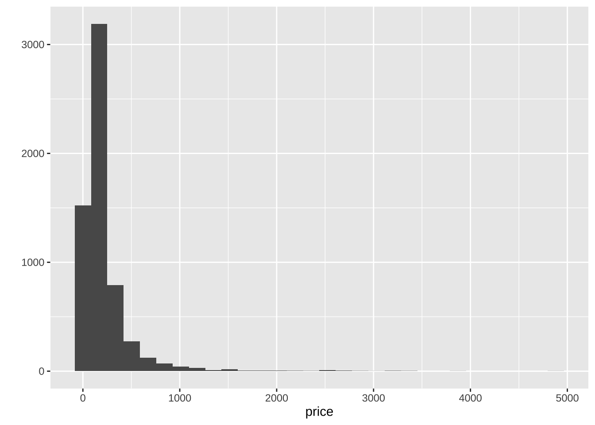
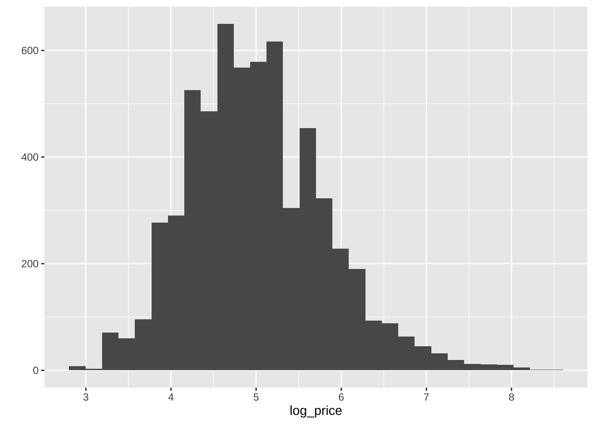
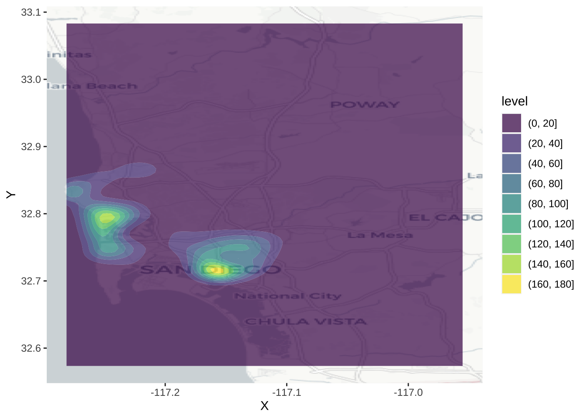

# Points {#points}

This chapter is based on the following references, which are great follow-up's on the topic:

* @lovelace2014introduction is a great introduction.
* Chapter 6 of @comber2015, in particular subsections 6.3 and 6.7.
* @bivand2013applied provides an in-depth treatment of spatial data in R.

## Dependencies

We will rely on the following libraries in this section, all of them included in the [book list](#Dependency-list):


```r
# For pretty table
library(knitr)
# All things geodata
library(sf)
```

```
## Linking to GEOS 3.8.1, GDAL 3.1.1, PROJ 6.3.1
```

```r
library(sp)
# Pretty graphics
library(ggplot2)
library(gridExtra)
# Thematic maps
library(tmap)
# Pretty maps
library(ggmap)
```

```
## Google's Terms of Service: https://cloud.google.com/maps-platform/terms/.
```

```
## Please cite ggmap if you use it! See citation("ggmap") for details.
```

```r
# For all your interpolation needs
library(gstat)
# For data manipulation
library(plyr)
```

Before we start any analysis, let us set the path to the directory where we are working. We can easily do that with `setwd()`. Please replace in the following line the path to the folder where you have placed this file -and where the `house_transactions` folder with the data lives.


```r
setwd('.')
```

## Data

For this session, we will use the set of Airbnb properties for San Diego (US), borrowed from the "Geographic Data Science with Python" book (see [here](https://geographicdata.science/book/data/airbnb/regression_cleaning.html) for more info on the dataset source). This covers the point location of properties advertised on the Airbnb website in the San Diego region.

Let us start by reading the data, which comes in a GeoJSON:


```r
db <- st_read("data/abb_sd/regression_db.geojson")
```

```
## Reading layer `regression_db' from data source `/Users/Franciscorowe 1/Dropbox/Francisco/uol/teaching/envs453/202021/san/data/abb_sd/regression_db.geojson' using driver `GeoJSON'
## Simple feature collection with 6110 features and 19 fields
## geometry type:  POINT
## dimension:      XY
## bbox:           xmin: -117.2812 ymin: 32.57349 xmax: -116.9553 ymax: 33.08311
## geographic CRS: WGS 84
```

We can then examine the columns of the table with the `colnames` method:


```r
colnames(db)
```

```
##  [1] "accommodates"       "bathrooms"          "bedrooms"          
##  [4] "beds"               "neighborhood"       "pool"              
##  [7] "d2balboa"           "coastal"            "price"             
## [10] "log_price"          "id"                 "pg_Apartment"      
## [13] "pg_Condominium"     "pg_House"           "pg_Other"          
## [16] "pg_Townhouse"       "rt_Entire_home.apt" "rt_Private_room"   
## [19] "rt_Shared_room"     "geometry"
```

The rest of this session will focus on two main elements of the table: the spatial dimension (as stored in the point coordinates), and the nightly price values, expressedin USD and contained in the `price` column. To get a sense of what they look like first, let us plot both. We can get a quick look at the non-spatial distribution of house values with the following commands:


```r
# Create the histogram
hist <- qplot(data=db,x=price)
hist
```

```
## `stat_bin()` using `bins = 30`. Pick better value with `binwidth`.
```

<div class="figure">

<p class="caption">(\#fig:unnamed-chunk-5)Raw AirBnb prices in San Diego</p>
</div>

This basically shows there is a lot of values concentrated around the lower end of the distribution but a few very large ones. A usual transformation to *shrink* these differences is to take logarithms. The original table already contains an additional column with the logarithm of each price (`log_price`).


```r
# Create the histogram
hist <- qplot(data=db, x=log_price)
hist
```

```
## `stat_bin()` using `bins = 30`. Pick better value with `binwidth`.
```

<div class="figure">

<p class="caption">(\#fig:unnamed-chunk-6)Log of AirBnb price in San Diego</p>
</div>

To obtain the spatial distribution of these houses, we need to focus on the `geometry` column. The easiest, quickest (and also "dirtiest") way to get a sense of what the data look like over space is using `plot`:


```r
plot(st_geometry(db))
```

<div class="figure">

<p class="caption">(\#fig:unnamed-chunk-7)Spatial distribution of AirBnb in San Diego</p>
</div>

Now this has the classic problem of cluttering: some portions of the map have so many points that we can't tell what the distribution is like. To get around this issue, there are two solutions: binning and smoothing.

## Binning

The two-dimensional sister of histograms are binning maps: we divide each of the two dimensions into "buckets", and count how many points fall within each bucket. Unlike histograms, we encode that count with a color gradient rather than a bar chart over an additional dimension (for that, we would need a 3D plot). These "buckets" can be squares (left) or hexagons (right):


```r
      # Squared binning
# Set up plot
sqbin <- ggplot() + 
# Add 2D binning with the XY coordinates as
# a dataframe
  geom_bin2d(
    data=as.data.frame(st_coordinates(db)), 
    aes(x=X, y=Y)
  )
      # Hex binning
# Set up plot
hexbin <- ggplot() +
# Add hex binning with the XY coordinates as
# a dataframe 
  geom_hex(
    data=as.data.frame(st_coordinates(db)),
    aes(x=X, y=Y)
  ) +
# Use viridis for color encoding (recommended)
  scale_fill_continuous(type = "viridis")
      # Bind in subplots
grid.arrange(sqbin, hexbin, ncol=2)
```


## KDE

Kernel Density Estimation (KDE) is a technique that creates a *continuous* representation of the distribution of a given variable, such as house prices. Although theoretically it can be applied to any dimension, usually, KDE is applied to either one or two dimensions.

### One-dimensional KDE

KDE over a single dimension is essentially a contiguous version of a histogram. We can see that by overlaying a KDE on top of the histogram of logs that we have created before:


```r
# Create the base
base <- ggplot(db, aes(x=log_price))
# Histogram
hist <- base + 
  geom_histogram(bins=50, aes(y=..density..))
# Overlay density plot
kde <- hist + 
  geom_density(fill="#FF6666", alpha=0.5, colour="#FF6666")
kde
```

<div class="figure">

<p class="caption">(\#fig:unnamed-chunk-9)Histogram and KDE of the log of AirBnb prices in San Diego</p>
</div>

The key idea is that we are smoothing out the discrete binning that the histogram involves. Note how the histogram is exactly the same as above shape-wise, but it has been rescalend on the Y axis to reflect probabilities rather than counts.

### Two-dimensional (spatial) KDE

Geography, at the end of the day, is usually represented as a two-dimensional space where we locate objects using a system of dual coordinates, `X` and `Y` (or latitude and longitude). Thanks to that, we can use the same technique as above to obtain a smooth representation of the distribution of a two-dimensional variable. The crucial difference is that, instead of obtaining a curve as the output, we will create a *surface*, where intensity will be represented with a color gradient, rather than with the second dimension, as it is the case in the figure above.

To create a spatial KDE in R, we can use general tooling for non-spatial points, such as the `stat_density2d_filled` method:


```r
# Create the KDE surface
kde <- ggplot(data = db) +
  stat_density2d_filled(
    data = as.data.frame(st_coordinates(db)), 
    aes(x = X, y = Y, alpha = ..level..),
    n = 16
  ) +
  # Tweak the color gradient
  scale_color_viridis_c() +
  # White theme
  theme_bw()
# Tip! Add invisible points to improve proportions
kde + geom_sf(alpha=0)
```

<div class="figure">

<p class="caption">(\#fig:unnamed-chunk-10)KDE of AirBnb properties in San Diego</p>
</div>

This approach generates a surface that represents the density of dots, that is an estimation of the probability of finding a house transaction at a given coordinate. However, without any further information, they are hard to interpret and link with previous knowledge of the area. To bring such context to the figure, we can plot an underlying basemap, using a cloud provider such as Google Maps or, as in this case, OpenStreetMap. To do it, we will leverage the library `ggmap`, which is designed to play nicely with the `ggplot2` family (hence the seemingly counterintuitive example above). Before we can plot them with the online map, we need to reproject them though.


```r
# Reproject coordinates
lon_lat <- st_transform(db, crs = 4326) %>%
  st_coordinates() %>%
  as.data.frame()
# Basemap
qmplot(
  X, 
  Y, 
  data = lon_lat, 
  geom="blank"
) +
  # KDE
  stat_density2d_filled(
    data = lon_lat, 
    aes(x = X, y = Y, alpha = ..level..),
    n = 16
  ) +
  # Tweak the color gradient
  scale_color_viridis_c()
```

```
## Using zoom = 11...
```

```
## Source : http://tile.stamen.com/terrain/11/356/824.png
```

```
## Source : http://tile.stamen.com/terrain/11/357/824.png
```

```
## Source : http://tile.stamen.com/terrain/11/358/824.png
```

```
## Source : http://tile.stamen.com/terrain/11/356/825.png
```

```
## Source : http://tile.stamen.com/terrain/11/357/825.png
```

```
## Source : http://tile.stamen.com/terrain/11/358/825.png
```

```
## Source : http://tile.stamen.com/terrain/11/356/826.png
```

```
## Source : http://tile.stamen.com/terrain/11/357/826.png
```

```
## Source : http://tile.stamen.com/terrain/11/358/826.png
```

```
## Source : http://tile.stamen.com/terrain/11/356/827.png
```

```
## Source : http://tile.stamen.com/terrain/11/357/827.png
```

```
## Source : http://tile.stamen.com/terrain/11/358/827.png
```

<div class="figure">

<p class="caption">(\#fig:unnamed-chunk-11)KDE of AirBnb properties in San Diego</p>
</div>

## Spatial Interpolation

The previous section demonstrates how to visualize the distribution of a set of spatial objects represented as points. In particular, given a bunch of house locations, it shows how one can effectively visualize their distribution over space and get a sense of the density of occurrences. Such visualization, because it is based on KDE, is based on a smooth continuum, rather than on a discrete approach (as a choropleth would do, for example).

Many times however, we are not particularly interested in learning about the density of occurrences, but about the distribution of a given value attached to each location. Think for example of weather stations and temperature: the location of the stations is no secret and rarely changes, so it is not of particular interest to visualize the density of stations; what we are usually interested instead is to know how temperature is distributed over space, given we only measure it in a few places. One could argue the example we have been working with so far, house prices in AirBnb, fits into this category as well: although where a house is advertised may be of relevance, more often we are interested in finding out what the "surface of price" looks like. Rather than *where are most houses being advertised?* we usually want to know *where the most expensive or most affordable* houses are located.

In cases where we are interested in creating a surface of a given value, rather than a simple density surface of occurrences, KDE cannot help us. In these cases, what we are interested in is *spatial interpolation*, a family of techniques that aim at exactly that: creating continuous surfaces for a particular phenomenon (e.g. temperature, house prices) given only a finite sample of observations. Spatial interpolation is a large field of research that is still being actively developed and that can involve a substantial amount of mathematical complexity in order to obtain the most accurate estimates possible^[There is also an important economic incentive to do this: some of the most popular applications are in the oil and gas or mining industries. In fact, the very creator of this technique, [Danie G. Krige](https://en.wikipedia.org/wiki/Danie_G._Krige), was a mining engineer. His name is usually used to nickname spatial interpolation as *kriging*.]. In this chapter, we will introduce the simplest possible way of interpolating values, hoping this will give you a general understanding of the methodology and, if you are interested, you can check out further literature. For example, @banerjee2014hierarchical or @cressie2015statistics are hard but good overviews.

### Inverse Distance Weight (IDW) interpolation

The technique we will cover here is called *Inverse Distance Weighting*, or IDW for convenience. @comber2015 offer a good description:

> In the *inverse distance weighting* (IDW) approach to interpolation, to estimate the value of $z$ at location $x$ a weighted mean of nearby observations is taken [...]. To accommodate the idea that observations of $z$ at points closer to $x$ should be given more importance in the interpolation, greater weight is given to these points [...]
>
> --- Page 204

The math^[Essentially, for any point $x$ in space, the IDW estimate for value $z$ is equivalent to $\hat{z} (x) = \dfrac{\sum_i w_i z_i}{\sum_i w_i}$ where $i$ are the observations for which we do have a value, and $w_i$ is a weight given to location $i$ based on its distance to $x$.] is not particularly complicated and may be found in detail elsewhere (the reference above is a good starting point), so we will not spend too much time on it. More relevant in this context is the intuition behind. The idea is that we will create a surface of house price by smoothing many values arranged along a regular grid and obtained by interpolating from the known locations to the regular grid locations. This will give us full and equal coverage to soundly perform the smoothing.

Enough chat, let's code^[If you want a complementary view of point interpolation in R, you can read more on this [fantastic blog post](https://swilke-geoscience.net/post/2020-09-10-kriging_with_r/kriging/)].

From what we have just mentioned, there are a few steps to perform an IDW spatial interpolation:

1. Create a regular grid over the area where we have house transactions.
1. Obtain IDW estimates for each point in the grid, based on the values of $k$ nearest neighbors.
1. Plot a smoothed version of the grid, effectively representing the surface of house prices.

Let us go in detail into each of them^[For the relevant calculations, we will be using the `gstat` library.]. First, let us set up a grid for the extent of the bounding box of our data (not the use of pipe, `%>%`, operator to chain functions):


```r
sd.grid <- db %>%
  st_bbox() %>%
  st_as_sfc() %>%
  st_make_grid(
    n = 100,
    what = "centers"
  ) %>%
  st_as_sf() %>%
  cbind(., st_coordinates(.))
```

The object `sd.grid` is a regular grid with 10,000 ($100 \times 100$) equally spaced cells:


```r
sd.grid
```

```
## Simple feature collection with 10000 features and 2 fields
## geometry type:  POINT
## dimension:      XY
## bbox:           xmin: -117.2795 ymin: 32.57604 xmax: -116.9569 ymax: 33.08056
## geographic CRS: WGS 84
## First 10 features:
##            X        Y                          x
## 1  -117.2795 32.57604 POINT (-117.2795 32.57604)
## 2  -117.2763 32.57604 POINT (-117.2763 32.57604)
## 3  -117.2730 32.57604  POINT (-117.273 32.57604)
## 4  -117.2698 32.57604 POINT (-117.2698 32.57604)
## 5  -117.2665 32.57604 POINT (-117.2665 32.57604)
## 6  -117.2632 32.57604 POINT (-117.2632 32.57604)
## 7  -117.2600 32.57604   POINT (-117.26 32.57604)
## 8  -117.2567 32.57604 POINT (-117.2567 32.57604)
## 9  -117.2535 32.57604 POINT (-117.2535 32.57604)
## 10 -117.2502 32.57604 POINT (-117.2502 32.57604)
```

Now, `sd.grid` only contain the location of points to which we wish to interpolate. That is, we now our "target" geography for which we'd like to have AirBnb prices, but we don't have price estimates. For that, on to the IDW, which will generate estimates for locations in `sd.grid` based on the observed prices in `db`. Again, this is hugely simplified by `gstat`:


```r
idw.hp <- idw(
  price ~ 1,         # Formula for IDW
  locations = db,    # Initial locations with values
  newdata=sd.grid    # Locations we want predictions for
)
```

```
## Warning in proj4string(d$data): CRS object has comment, which is lost in output
```

```
## Warning in proj4string(newdata): CRS object has comment, which is lost in output
```

```
## [inverse distance weighted interpolation]
```

```
## Warning in proj4string(newdata): CRS object has comment, which is lost in output
```

Boom! We've got it. Let us pause for a second to see how we just did it. First, we pass `price ~ 1`. This specifies the formula we are using to model house prices. The name on the left of `~` represents the variable we want to explain, while everything to its right captures the *explanatory* variables. Since we are considering the simplest possible case, we do not have further variables to add, so we simply write `1`. Then we specify the original locations for which we do have house prices (our original `db` object), and the points where we want to interpolate the house prices (the `sd.grid` object we just created above). One more note: by default, `idw` uses all the available observations, weighted by distance, to provide an estimate for a given point. If you want to modify that and restrict the maximum number of neighbors to consider, you need to tweak the argument `nmax`, as we do above by using the 150 neares observations to each point^[Have a play with this because the results do change significantly. Can you reason why?].

The object we get from `idw` is another spatial table, just as `db`, containing the interpolated values. As such, we can inspect it just as with any other of its kind. For example, to check out the top of the estimated table:


```r
head(idw.hp)
```

```
## Simple feature collection with 6 features and 2 fields
## geometry type:  POINT
## dimension:      XY
## bbox:           xmin: -117.2795 ymin: 32.57604 xmax: -117.2632 ymax: 32.57604
## geographic CRS: WGS 84
##   var1.pred var1.var                   geometry
## 1  211.4131       NA POINT (-117.2795 32.57604)
## 2  211.1100       NA POINT (-117.2763 32.57604)
## 3  210.8035       NA  POINT (-117.273 32.57604)
## 4  210.4936       NA POINT (-117.2698 32.57604)
## 5  210.1804       NA POINT (-117.2665 32.57604)
## 6  209.8641       NA POINT (-117.2632 32.57604)
```

The column we will pay attention to is `var1.pred`. For a hypothetical house advertised at the location in the first row of point in `sd.grid`, the price IDW would guess it would cost, based on prices nearby, is the first element of column `var1.pred` in `idw.hp`.

### A surface of housing prices

Once we have the IDW object computed, we can plot it to explore the distribution, not of AirBnb locations in this case, but of house prices over the geography of San Diego. To do this using `ggplot2`, we first append the coordinates of each grid cell as columns of the table:


```r
idw.hp = idw.hp %>%
  cbind(st_coordinates(.))
```

Now, we can visualise the surface using standard `ggplot2` tools:

```r
ggplot(idw.hp, aes(x = X, y = Y, fill = var1.pred)) +
  geom_raster()
```


And we can "dress it up" a bit further:


```r
ggplot(idw.hp, aes(x = X, y = Y, fill = var1.pred)) +
  geom_raster() +
  scale_fill_viridis_b() +
  theme_void() +
  geom_sf(alpha=0)
```


Looking at this, we can start to tell some patterns. To bring in context, it would be great to be able to add a basemap layer, as we did for the KDE. This is conceptually very similar to what we did above, starting by reprojecting the points and continuing by overlaying them on top of the basemap. However, technically speaking it is not possible because `ggmap` --the library we have been using to display tiles from cloud providers-- does not play well with our own rasters (i.e. the price surface). At the moment, it is surprisingly tricky to get this to work, so we will park it for now^[**BONUS** if you can figure out a way to do it yourself!]. 

### _"What should the next house's price be?"_

The last bit we will explore in this session relates to prediction for new values. Imagine you are a real state data scientist working for Airbnb and your boss asks you to give an estimate of how much a new house going into the market should cost. The only information you have to make such a guess is the location of the house. In this case, the IDW model we have just fitted can help you. The trick is realizing that, instead of creating an entire grid, all we need is to obtain an estimate of a single location.

Let us say, a new house is going to be advertised on the coordinates `X = -117.02259063720702, Y = 32.76511965117273` as expressed in longitude and latitude. In that case, we can do as follows:


```r
pt <- c(X = -117.02259063720702, Y = 32.76511965117273) %>%
  st_point() %>%
  st_sfc() %>%
  st_sf(crs = "EPSG:4326")
idw.one <- idw(price ~ 1, locations=db, newdata=pt)
```

```
## Warning in proj4string(d$data): CRS object has comment, which is lost in output
```

```
## Warning in proj4string(newdata): CRS object has comment, which is lost in output
```

```
## [inverse distance weighted interpolation]
```

```
## Warning in proj4string(newdata): CRS object has comment, which is lost in output
```

```r
idw.one
```

```
## Simple feature collection with 1 feature and 2 fields
## geometry type:  POINT
## dimension:      XY
## bbox:           xmin: -117.0226 ymin: 32.76512 xmax: -117.0226 ymax: 32.76512
## geographic CRS: WGS 84
##   var1.pred var1.var                   geometry
## 1  171.4141       NA POINT (-117.0226 32.76512)
```

And, as show above, the estimated value is $171.4141334^[**PRO QUESTION** Is that house expensive or cheap, as compared to the other houses sold in this dataset? Can you figure out where the house is in the distribution?].


