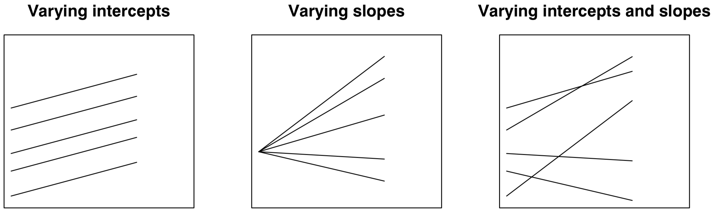
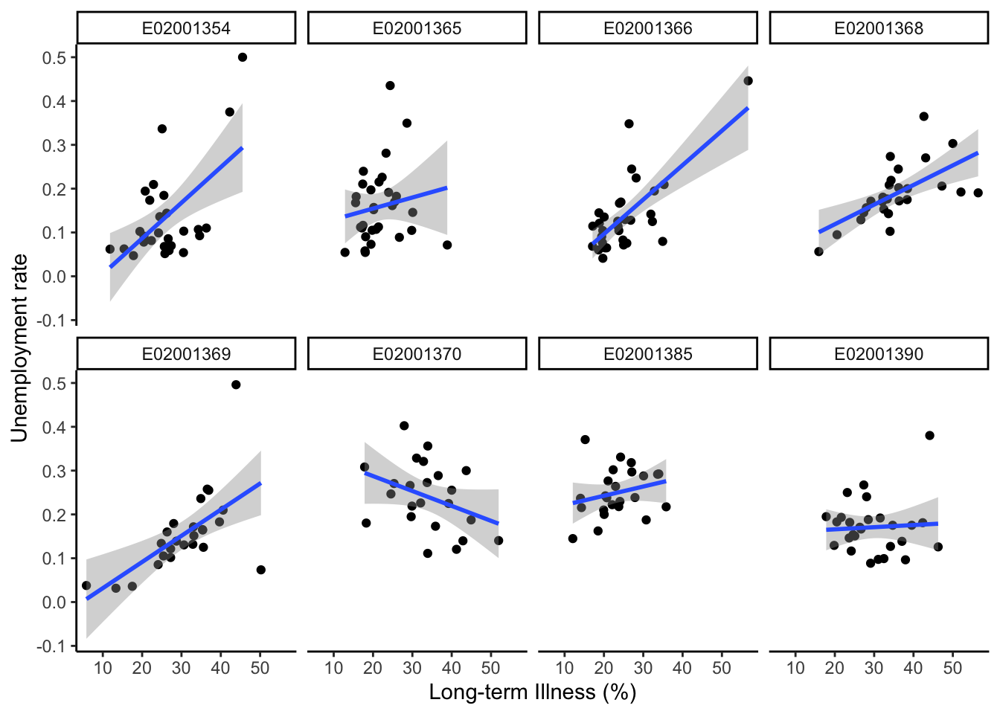
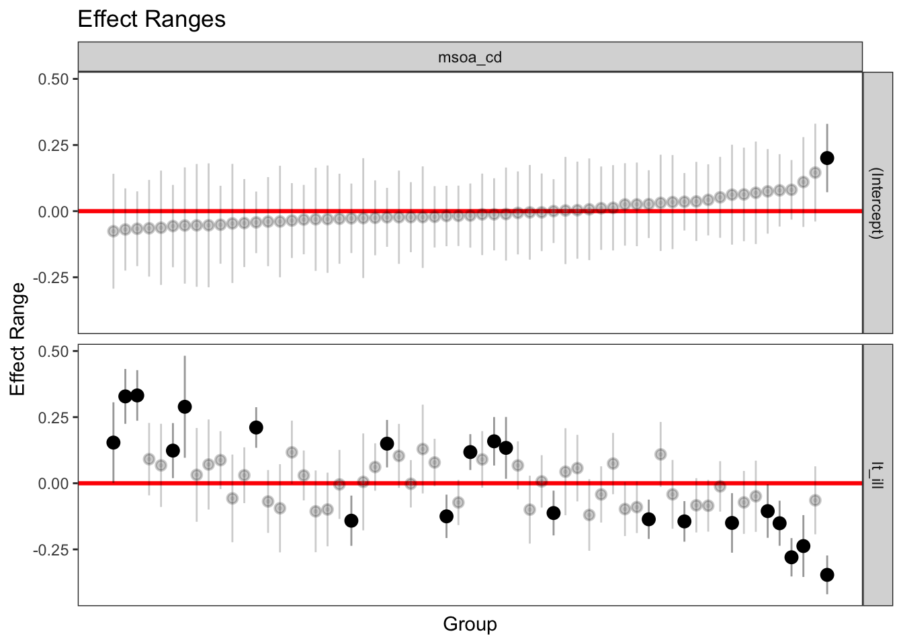
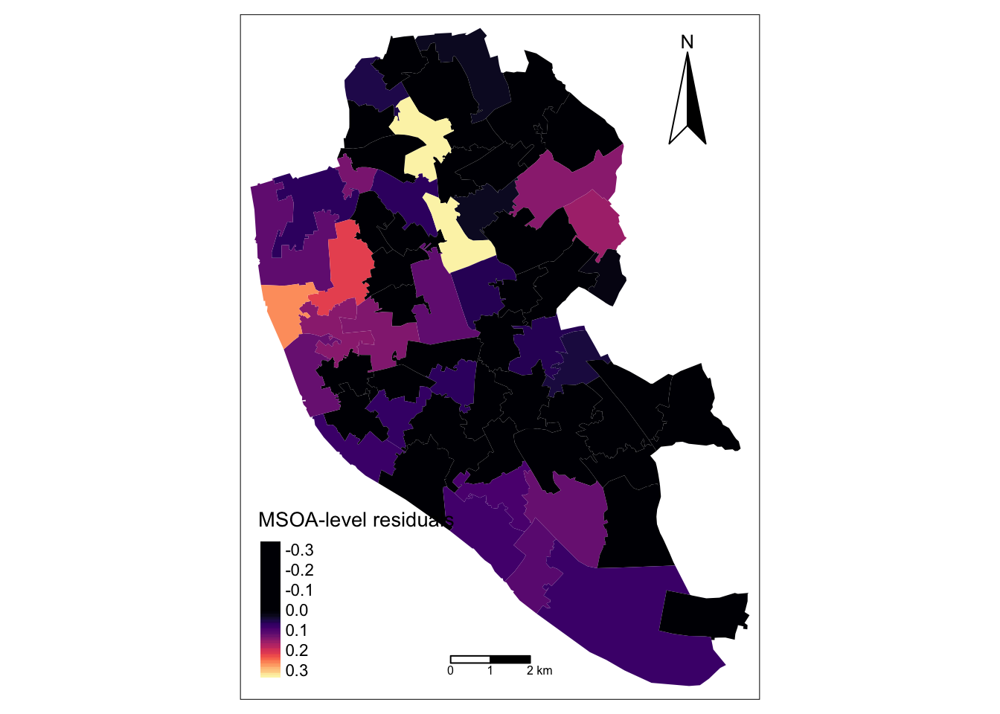

# Multilevel Modelling - Part 2

This chapter^[This note is part of [Spatial Analysis Notes](index.html) <a rel="license" href="http://creativecommons.org/licenses/by-nc-sa/4.0/"></a><br /><span xmlns:dct="http://purl.org/dc/terms/" property="dct:title">Multilevel Modelling -- Random Slope Model</span> by <a xmlns:cc="http://creativecommons.org/ns#" href="http://franciscorowe.com" property="cc:attributionName" rel="cc:attributionURL">Francisco Rowe</a> is licensed under a <a rel="license" href="http://creativecommons.org/licenses/by-nc-sa/4.0/">Creative Commons Attribution-NonCommercial-ShareAlike 4.0 International License</a>.] provides an introduction to multi-level data structures and multi-level modelling.

The content of this chapter is based on:

* @Gelman_Hill_2006_book provides an excellent and intuitive explanation of multilevel modelling and data analysis in general. Read Part 2A for a really good explanation of multilevel models.

* @bristol2020 is an useful online resource on multilevel modelling and is free!

This Chapter is part of [Spatial Analysis Notes](index.html), a compilation hosted as a GitHub repository that you can access it in a few ways:

* As a [download](https://github.com/GDSL-UL/san/archive/master.zip) of a `.zip` file that contains all the materials.
* As an [html
  website](https://gdsl-ul.github.io/san/multilevel-modelling-part-2.html).
* As a [pdf
  document](https://gdsl-ul.github.io/san/spatial_analysis_notes.pdf)
* As a [GitHub repository](https://github.com/GDSL-UL/san).

## Dependencies

This chapter uses the following libraries: Ensure they are installed on your machine^[You can install package `mypackage` by running the command `install.packages("mypackage")` on the R prompt or through the `Tools --> Install Packages...` menu in RStudio.] before loading them executing the following code chunk:


```r
# Data manipulation, transformation and visualisation
library(tidyverse)
```

```
## Warning: package 'tibble' was built under R version 3.6.2
```

```r
# Nice tables
library(kableExtra)
# Simple features (a standardised way to encode vector data ie. points, lines, polygons)
library(sf) 
# Spatial objects conversion
library(sp) 
# Thematic maps
library(tmap) 
# Colour palettes
library(RColorBrewer) 
# More colour palettes
library(viridis) # nice colour schemes
# Fitting multilevel models
library(lme4)
# Tools for extracting information generated by lme4
library(merTools)
```

```
## Warning: package 'MASS' was built under R version 3.6.2
```

```r
# Exportable regression tables
library(jtools)
library(stargazer)
library(sjPlot)
```

## Data

For this chapter, we will data for Liverpool from England's 2011 Census. The original source is the [Office of National Statistics](https://www.nomisweb.co.uk/home/census2001.asp) and the dataset comprises a number of selected variables capturing demographic, health and socio-economic of the local resident population at four geographic levels: Output Area (OA), Lower Super Output Area (LSOA), Middle Super Output Area (MSOA) and Local Authority District (LAD). The variables include population counts and percentages. For a description of the variables, see the readme file in the mlm data folder.^[Read the file in R by executing `read_tsv("data/mlm/readme.txt")`]

Let us read the data:


```r
# clean workspace
rm(list=ls())
# read data
oa_shp <- st_read("data/mlm/oa.shp")
```

## Conceptual Overview

So far, we have estimated varying-intercept models; that is, when the intercept ($\beta_{0}$) is allowed to vary by group (eg. geographical area) - as shown in Fig. 1(a). The strength of the relationship between $y$ (i.e. unemployment rate) and $x$ (long-term illness) has been assumed to be the same across groups (i.e. MSOAs), as captured by the regression slope ($\beta_{1}$). Yet it can also vary by group as shown in Fig. 1(b), or we can observe group variability for both intercepts and slopes as represented in Fig. 1(c).



### Exploratory Analysis: Varying Slopes

Let's then explore if there is variation in the relationship between unemployment rate and the share of population in long-term illness. We do this by selecting the 8 MSOAs containing OAs with the highest unemployment rates in Liverpool.


```r
# Sort data 
oa_shp <- oa_shp %>% arrange(-unemp)
oa_shp[1:9, c("msoa_cd", "unemp")]
```

```
## Simple feature collection with 9 features and 2 fields
## geometry type:  MULTIPOLYGON
## dimension:      XY
## bbox:           xmin: 335032 ymin: 387777 xmax: 338576.1 ymax: 395022.4
## epsg (SRID):    NA
## proj4string:    +proj=tmerc +lat_0=49 +lon_0=-2 +k=0.9996012717 +x_0=400000 +y_0=-100000 +ellps=airy +units=m +no_defs
##     msoa_cd     unemp                       geometry
## 1 E02001354 0.5000000 MULTIPOLYGON (((337491.2 39...
## 2 E02001369 0.4960630 MULTIPOLYGON (((335272.3 39...
## 3 E02001366 0.4461538 MULTIPOLYGON (((338198.1 39...
## 4 E02001365 0.4352941 MULTIPOLYGON (((336572.2 39...
## 5 E02001370 0.4024390 MULTIPOLYGON (((336328.3 39...
## 6 E02001390 0.3801653 MULTIPOLYGON (((335833.6 38...
## 7 E02001354 0.3750000 MULTIPOLYGON (((337403 3949...
## 8 E02001385 0.3707865 MULTIPOLYGON (((336251.6 38...
## 9 E02001368 0.3648649 MULTIPOLYGON (((335209.3 39...
```

```r
# Select MSOAs
s_t8 <- oa_shp %>% dplyr::filter(
    as.character(msoa_cd) %in% c(
      "E02001354", 
      "E02001369", 
      "E02001366", 
      "E02001365", 
      "E02001370", 
      "E02001390", 
      "E02001368", 
      "E02001385")
    )
```
And then we generate a set of scatter plots and draw regression lines for each MSOA.


```r
ggplot(s_t8, aes(x = lt_ill, y = unemp)) + 
  geom_point() + 
  geom_smooth(method = "lm") +
  facet_wrap(~ msoa_cd, nrow = 2) +
  ylab("Unemployment rate") + 
  xlab("Long-term Illness (%)") +
  theme_classic()
```

```
## `geom_smooth()` using formula 'y ~ x'
```


      
We can observe great variability in the relationship between unemployment rates and the percentage of population in long-term illness. A strong and positive relationship exists in MSOA `E02001366` (Tuebrook and Stoneycroft), while it is negative in MSOA `E02001370` (Everton) and neutral in MSOA `E02001390` (Princes Park & Riverside). This visual inspection suggests that accounting for differences in the way unmployment rates relate to long-term illness is important. Contextual factors may differ across MSOAs in systematic ways.

## Estimating Varying Intercept and Slopes Models

A way to capture for these group differences in the relationship between unemployment rates and long-term illness is to allow the relevant slope to vary by group (i.e. MSOA). We can do this estimating the following model:

OA-level:

$$y_{ij} = \beta_{0j} + \beta_{1j}x_{ij} + e_{ij}$$

MSOA-level:

$$\beta_{0j} = \beta_{0} + u_{0j}$$
$$\beta_{1j} = \beta_{1} + u_{1j} $$
Replacing the first equation into the second generates:

$$y_{ij} = (\beta_{0} + u_{0j}) + (\beta_{1} + u_{1j})x_{ij} + e_{ij}$$
where, as in the previous Chapter, $y$ the proportion of unemployed population in OA $i$ within MSOA $j$; $\beta_{0}$ is the fixed intercept (averaging over all MSOAs); $u_{0j}$ represents the MSOA-level residuals, or *random effects*, of the intercept; $e_{ij}$ is the individual-level residuals; and, $x_{ij}$ represents the percentage of long-term illness population. *But* now we have a varying slope represented by $\beta_{1}$ and $u_{1j}$: $\beta_{1}$ is estimated average slope - fixed part of the model; and, $u_{1j}$ is the estimated group-level errors of the slope.

To estimate such model, we add `lt_ill` in the bracket with a `+` sign between `1` and `|` i.e. `(1 + lt_ill | msoa_cd)`.


```r
# attach df
attach(oa_shp)

# change to proportion
oa_shp$lt_ill <- lt_ill/100

# specify a model equation
eq6 <- unemp ~ lt_ill + (1 + lt_ill | msoa_cd)
model6 <- lmer(eq6, data = oa_shp)

# estimates
summary(model6)
```

```
## Linear mixed model fit by REML ['lmerMod']
## Formula: unemp ~ lt_ill + (1 + lt_ill | msoa_cd)
##    Data: oa_shp
## 
## REML criterion at convergence: -4762.8
## 
## Scaled residuals: 
##     Min      1Q  Median      3Q     Max 
## -3.6639 -0.5744 -0.0873  0.4565  5.4876 
## 
## Random effects:
##  Groups   Name        Variance Std.Dev. Corr 
##  msoa_cd  (Intercept) 0.003428 0.05855       
##           lt_ill      0.029427 0.17154  -0.73
##  Residual             0.002474 0.04974       
## Number of obs: 1584, groups:  msoa_cd, 61
## 
## Fixed effects:
##             Estimate Std. Error t value
## (Intercept) 0.047650   0.008634   5.519
## lt_ill      0.301259   0.028163  10.697
## 
## Correlation of Fixed Effects:
##        (Intr)
## lt_ill -0.786
```

In this model, the estimated standard deviation of the unexplained within-MSOA variation is 0.04974, and the estimated standard deviation of the MSOA intercepts is 0.05855. But, additionally, we also have estimates of standard deviation of the MSOA slopes (0.17154) and correlation between MSOA-level residuals for the intercept and slope (-0.73). While the former measures the extent of average deviation in the slopes across MSOAs, the latter indicates that the intercept and slope MSOA-level residuals are negatively associated; that is, MSOAs with large slopes have relatively smaller intercepts and *vice versa*. We will come back to this in Section [Interpreting Correlations Between Group-level Intercepts and Slopes].

Similarly, the correlation of fixed effects indicates a negative relationship between the intercept and slope of the average regression model; that is, as the average model intercept tends to increase, the average strength of the relationship between unemployment rate and long-term illness decreases and *vice versa*.

We then explore the estimated average coefficients (*fixed effects*):


```r
fixef(model6)
```

```
## (Intercept)      lt_ill 
##  0.04764998  0.30125916
```

yields an estimated regression line in an average LSOA: $y =  0.04764998 + 0.30125916x$. The fixed intercept indicates that the average unemployment rate is 0.05 if the percentage of population with long-term illness is zero.The fixed slope indicates that the average relationship between unemployment rate and long-term illness is positive across MSOAs i.e. as the percentage of population with long-term illness increases by 1 percentage point, the unemployment rate increases by 0.3. 

We look the estimated MSOA-level errors (*random effects*):


```r
ranef_m6 <- ranef(model6)
head(ranef_m6$msoa_cd, 5)
```

```
##            (Intercept)      lt_ill
## E02001347 -0.026561023  0.02717992
## E02001348  0.001690577 -0.11534207
## E02001349 -0.036084591  0.05547012
## E02001350  0.032241334 -0.14298965
## E02001351  0.086214974 -0.28130545
```
Recall these estimates indicate the extent of deviation of the MSOA-specific intercept and slope from the estimated model average captured by the fixed model component.

We can also regain the estimated intercept and slope for each county by adding the estimated MSOA-level errors to the estimated average coefficients; or by executing:


```r
#coef(model6)
```

We are normally more interested in identifying the extent of deviation and its significance. To this end, we create a caterpillar plot:


```r
# plot
plotREsim(REsim(model6))
```



These plots reveal some interesting patterns. First, only one MSOA, containing wards such as Tuebrook and Stoneycroft, Anfield & Everton, seems to have a statistically significantly different intercept, or average unemployment rate. Confidence intervals overlap zero for all other 60 MSOAs. Despite this, note that when a slope is allowed to vary by group, it generally makes sense for the intercept to also vary. Second, significant variability exists in the association between unemployment rate and long-term illness across MSOAs. Ten MSOAs display a significant positive association, while 12 exhibit a significantly negative relationship. Third, these results reveal that geographical differences in the relationship between unemployment rate and long-term illness can explain the significant differences in average unemployment rates in the varying intercept only model.

Let's try to get a better understanding of the varying relationship between unemployment rate and long-term illness by mapping the relevant MSOA-level errors.


```r
# read data
msoa_shp <- st_read("data/mlm/MSOA.shp")
```

```
## Reading layer `MSOA' from data source `/Users/Franciscorowe/Dropbox/Francisco/uol/teaching/envs453/201920/lectures/san/data/mlm/MSOA.shp' using driver `ESRI Shapefile'
## Simple feature collection with 61 features and 17 fields
## geometry type:  MULTIPOLYGON
## dimension:      XY
## bbox:           xmin: 333086.1 ymin: 381426.3 xmax: 345636 ymax: 397980.1
## epsg (SRID):    27700
## proj4string:    +proj=tmerc +lat_0=49 +lon_0=-2 +k=0.9996012717 +x_0=400000 +y_0=-100000 +ellps=airy +towgs84=446.448,-125.157,542.06,0.15,0.247,0.842,-20.489 +units=m +no_defs
```

```r
# create a dataframe for MSOA-level random effects
re_msoa_m6 <- REsim(model6) %>% filter(groupFctr == "msoa_cd") %>%
  filter(term == "lt_ill")
str(re_msoa_m6)
```

```
## 'data.frame':	61 obs. of  6 variables:
##  $ groupFctr: chr  "msoa_cd" "msoa_cd" "msoa_cd" "msoa_cd" ...
##  $ groupID  : chr  "E02001347" "E02001348" "E02001349" "E02001350" ...
##  $ term     : chr  "lt_ill" "lt_ill" "lt_ill" "lt_ill" ...
##  $ mean     : num  0.0343 -0.1078 0.0554 -0.1407 -0.2807 ...
##  $ median   : num  0.0376 -0.1093 0.054 -0.1392 -0.2797 ...
##  $ sd       : num  0.0455 0.0728 0.0835 0.0363 0.0404 ...
```

```r
# merge data
msoa_shp <- merge(x = msoa_shp, y = re_msoa_m6, by.x = "MSOA_CD", by.y = "groupID")
```


```r
# ensure geometry is valid
msoa_shp = lwgeom::st_make_valid(msoa_shp)

# create a map
legend_title = expression("MSOA-level residuals")
map_msoa = tm_shape(msoa_shp) +
  tm_fill(col = "median", title = legend_title, palette = magma(256, begin = 0, end = 1), style = "cont") + 
  tm_borders(col = "white", lwd = .01)  + 
  tm_compass(type = "arrow", position = c("right", "top") , size = 4) + 
  tm_scale_bar(breaks = c(0,1,2), text.size = 0.5, position =  c("center", "bottom")) 
map_msoa
```



The map indicates that the relationship between unemployment rate and long-term illness is tends to stronger and positive in northern MSOAs; that is, the percentage of population with long-term illness explains a greater share of the variation in unemployment rates in these locations. As expected, a greater share of population in long-term illness is associated with higher local unemployment. In contrast, the relationship between unemployment rate and long-term illness tends to operate in the reverse direction in north-east and middle-southern MSOAs. In these MSOAs, OAs tend to have a higher unemployment rate relative the share of population in long-term illness. You can confirm this examining the data for specific MSOA executing:


```r
oa_shp %>% dplyr::select(msoa_cd, ward_nm, unemp, lt_ill) %>%
    filter(as.character(msoa_cd) == "E02001370")
```

```
## Simple feature collection with 23 features and 4 fields
## geometry type:  MULTIPOLYGON
## dimension:      XY
## bbox:           xmin: 335885 ymin: 391134.2 xmax: 337596.3 ymax: 392467
## epsg (SRID):    NA
## proj4string:    +proj=tmerc +lat_0=49 +lon_0=-2 +k=0.9996012717 +x_0=400000 +y_0=-100000 +ellps=airy +units=m +no_defs
## First 10 features:
##      msoa_cd                  ward_nm     unemp    lt_ill
## 1  E02001370                  Everton 0.4024390 0.2792793
## 2  E02001370 Tuebrook and Stoneycroft 0.3561644 0.3391813
## 3  E02001370                  Everton 0.3285714 0.3106383
## 4  E02001370                  Everton 0.3209877 0.3283019
## 5  E02001370                  Anfield 0.3082707 0.1785714
## 6  E02001370                  Everton 0.3000000 0.4369501
## 7  E02001370                  Everton 0.2886598 0.3657143
## 8  E02001370                  Everton 0.2727273 0.3375000
## 9  E02001370                  Everton 0.2705882 0.2534247
## 10 E02001370 Tuebrook and Stoneycroft 0.2661290 0.2941176
##                          geometry
## 1  MULTIPOLYGON (((336328.3 39...
## 2  MULTIPOLYGON (((337481.5 39...
## 3  MULTIPOLYGON (((336018.5 39...
## 4  MULTIPOLYGON (((336475.7 39...
## 5  MULTIPOLYGON (((337110.6 39...
## 6  MULTIPOLYGON (((336516.3 39...
## 7  MULTIPOLYGON (((336668.6 39...
## 8  MULTIPOLYGON (((336173.8 39...
## 9  MULTIPOLYGON (((336870 3917...
## 10 MULTIPOLYGON (((337363.8 39...
```

Now try adding a group-level predictor and an  individual-level predictor to the model. Unsure, look at the Sections [Adding Group-level Predictors] and [Adding Individual-level Predictors] in the previous Chapter.


## Interpreting Correlations Between Group-level Intercepts and Slopes

Correlations of random effects are confusing to interpret. Key for their appropriate interpretation is to recall they refer to group-level residuals i.e. deviation of intercepts and slopes from the average model intercept and slope. A strong *negative* correlation indicates that groups with high intercepts have relatively low slopes, and *vice versa*. A strong *positive* correlation indicates that groups with high intercepts have relatively high slopes, and *vice versa*. A correlation close to *zero* indicate little or no systematic between intercepts and slopes. Note that a high correlation between intercepts and slopes is not a problem, but it makes the interpretation of the estimated intercepts more challenging. For this reason, a suggestion is to center  predictors ($x's$); that is, substract their average value ($z = x - \bar{x}$). For a more detailed discussion, see @bristol2020.

To illustrate this, let's reestimate our model adding an individual-level predictor: the share of population with no educational qualification.


```r
# centering to the mean
oa_shp$z_no_qual <- no_qual/100 - mean(no_qual/100)
oa_shp$z_lt_ill <- lt_ill - mean(lt_ill)

# specify a model equation
eq7 <- unemp ~ z_lt_ill + z_no_qual + (1 + z_lt_ill | msoa_cd)
model7 <- lmer(eq7, data = oa_shp)

# estimates
summary(model7)
```

```
## Linear mixed model fit by REML ['lmerMod']
## Formula: unemp ~ z_lt_ill + z_no_qual + (1 + z_lt_ill | msoa_cd)
##    Data: oa_shp
## 
## REML criterion at convergence: -4940.7
## 
## Scaled residuals: 
##     Min      1Q  Median      3Q     Max 
## -3.6830 -0.5949 -0.0868  0.4631  6.3556 
## 
## Random effects:
##  Groups   Name        Variance  Std.Dev. Corr 
##  msoa_cd  (Intercept) 8.200e-04 0.02864       
##           z_lt_ill    2.161e-06 0.00147  -0.04
##  Residual             2.246e-03 0.04739       
## Number of obs: 1584, groups:  msoa_cd, 61
## 
## Fixed effects:
##               Estimate Std. Error t value
## (Intercept)  0.1163682  0.0039201   29.68
## z_lt_ill    -0.0003130  0.0003404   -0.92
## z_no_qual    0.3245811  0.0221347   14.66
## 
## Correlation of Fixed Effects:
##           (Intr) z_lt_l
## z_lt_ill  -0.007       
## z_no_qual -0.015 -0.679
```

How do you interpret the random effect correlation?

## Model building

Now we know how to estimate multilevel regression models in *R*. The question that remains is: *When does multilevel modeling make a difference?* The short answer is: when there is little group-level variation. When there is very little group-level variation, the multilevel modelling reduces to classical linear regression estimates *with no group indicators*. Inversely, when group-level coefficients vary greatly (compared to their standard errors of estimation), multilevel modelling reduces to classical regression *with group indicators* @Gelman_Hill_2006_book.

*How do you go about building a model?*

We generally start simple by fitting simple linear regressions and then work our way up to a full multilevel model - see @Gelman_Hill_2006_book p. 270.

*How many groups are needed?* 

As an absolute minimum, more than two groups are required. With only one or two groups, a multilevel model reduces to a linear regression model.

*How many observations per group?* 

Two observations per group is sufficient to fit a multilevel model. 

### Model Comparison

*How we assess different candidate models?* We can use the function `anova()` and assess various statistics: The Akaike Information Criterion (AIC), the Bayesian Information Criterion (BIC), Loglik and Deviance. Generally, we look for lower scores for all these indicators. We can also refer to the *Chisq* statistic below. It tests the hypothesis of whether additional predictors improve model fit. Particularly it tests the *Null Hypothesis* whether the coefficients of the additional predictors equal 0. It does so comparing the deviance statistic and determining if changes in the deviance are statistically significant. Note that a major limitation of the deviance test is that it is for nested models i.e. a model being compared must be nested in the other. Below we compare our two models. The results indicate that adding an individual-level predictor (i.e. the share of population with no qualification) provides a model with better. 


```r
anova(model6, model7)
```

```
## refitting model(s) with ML (instead of REML)
```

```
## Data: oa_shp
## Models:
## model6: unemp ~ lt_ill + (1 + lt_ill | msoa_cd)
## model7: unemp ~ z_lt_ill + z_no_qual + (1 + z_lt_ill | msoa_cd)
##        Df     AIC     BIC logLik deviance  Chisq Chi Df Pr(>Chisq)    
## model6  6 -4764.7 -4732.5 2388.3  -4776.7                             
## model7  7 -4956.5 -4918.9 2485.2  -4970.5 193.76      1  < 2.2e-16 ***
## ---
## Signif. codes:  0 '***' 0.001 '**' 0.01 '*' 0.05 '.' 0.1 ' ' 1
```
